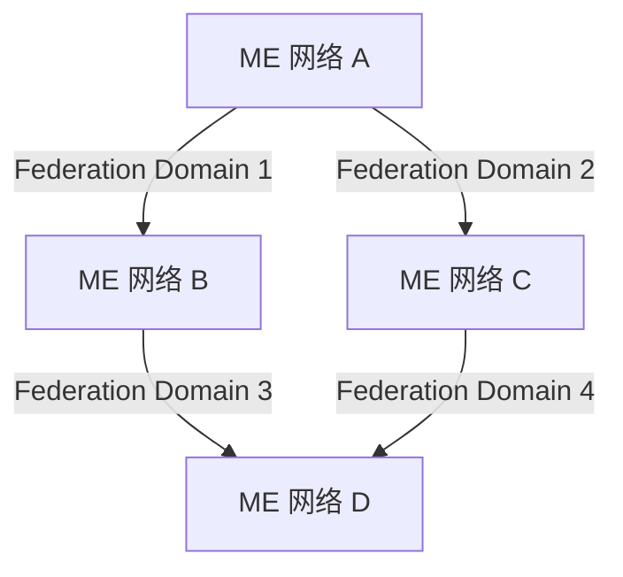
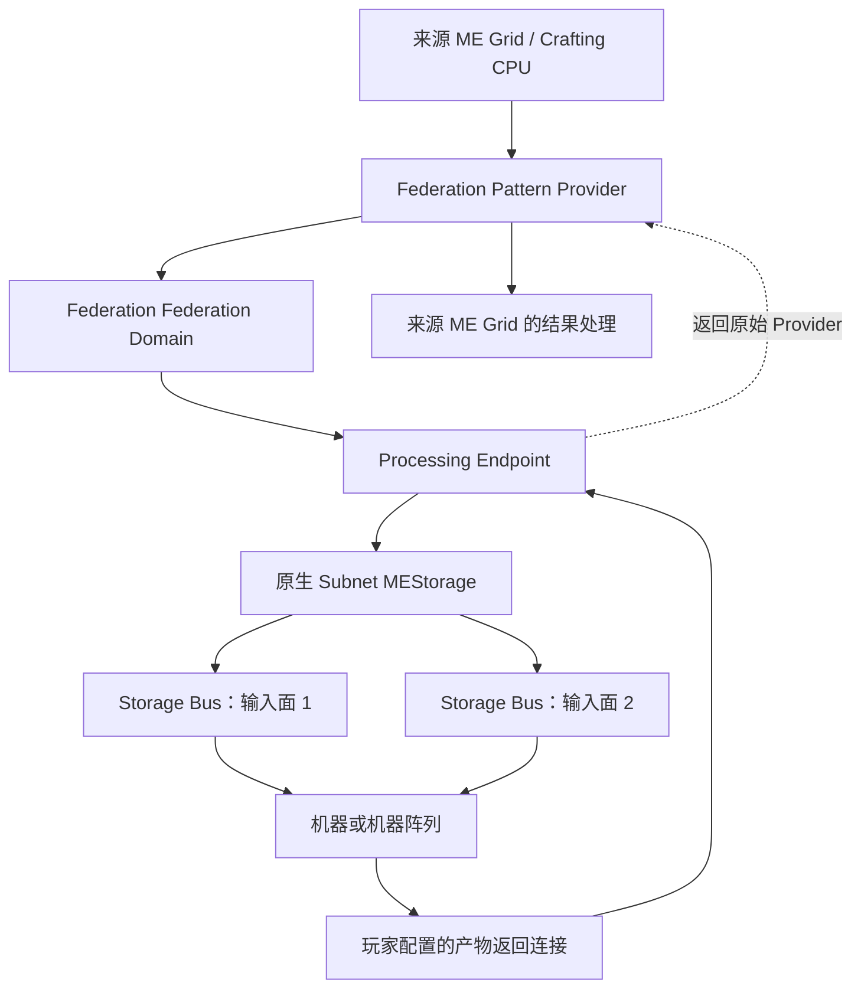

# AE2 Federation — 模组设计文档

**版本：** 0.4  
**日期：** 2026-09-12  
**文档类型：** 产品概念、系统架构与实现验收基线  
**模组名称：** AE2 Federation  
**首个开发目标：** Minecraft 1.21.1 / NeoForge；当前只开发 NeoForge 版本。  
**依赖：** Applied Energistics 2（AE2）；GUI 暂定 LDLib2。NeoForge、AE2、LDLib2 的具体发布版本或提交在 M0 联合锁定。  
**代码与版本策略：** 一个 `common` 共享全部可复用实现，配合薄版本目录；按经过验证的兼容范围组织构建，不默认整个 Minecraft 版本系列共用一个 JAR。

> AE2 Federation 让多个保持独立的 ME Network，通过可配置、可观测的 Federation Domain 共享能力。各网络继续使用自己的 AE2 存储、合成与自动化机制；Federation 保存网络之间的共享 Policy，并根据联邦域连通关系启用原生能力访问。

> **执行架构：** Federation 提供管理界面、连接配置及必要的接入适配；绝大多数业务操作直接委托（delegate）给 AE2 的实际原生对象、服务与方法。新增设备和虚拟连接应继续表达 AE2 已有的存储挂载、Provider、目标与合成能力抽象。

## 命名约定

模组名称统一为 **AE2 Federation**，用于文档标题、项目介绍和对外发布，以 **AE2** 标识其所属的模组生态。

**ME** 沿用 AE2 的游戏内术语命名方式，用作相关方块、设备或功能名称的前缀，例如 **ME Federation Pattern Provider**、**ME Federation Bridge** 和 **ME Federation Processing Endpoint**。这些游戏内名称保留 ME 前缀，不随模组名称改为 AE2 前缀。

后文可以用 **Federation** 简称本模组或其协作机制；**ME Federation** 不作为模组名称使用。

**ME Network** 指原生 AE2 网络。**ME Federation Domain（ME联邦域）** 指由 Bridge 或 Router / Cable 形成的 Federation 连通与管理范围；它不是额外方块，也不是管理全部联邦域的全局 Matrix。一个 ME Network 可以同时属于多个 Domain，Domain 之间不因此合并。代码中该概念统一称 `FederationDomain*`，与存储来源域 `NativeSourceDomain`、Processing 目标域 `NativeTargetDomain*` 区分。

| 注册 ID | 英文名称 | 简体中文名称 | 旧 ID（仅兼容读取） |
|---|---|---|---|
| `ae2federation:router` | ME Federation Router | ME联邦路由器 | `ae2federation:hub` |
| `ae2federation:bridge` | ME Federation Bridge | ME联邦桥 | `ae2federation:multipart_bridge` |
| `ae2federation:cable` | ME Federation Cable | ME联邦线缆 | `ae2federation:federation_cable` |
| `ae2federation:pattern_provider` | ME Federation Pattern Provider | ME联邦样板供应器 | — |
| `ae2federation:processing_endpoint` | ME Federation Processing Endpoint | ME联邦处理端点 | 未改名 |

旧 ID 通过 NeoForge 注册表别名（`DeferredRegister#addAlias`）映射到新条目，覆盖方块、物品和方块实体类型；Bridge 作为 AE2 multipart 部件按物品 ID 保存在线缆总线中，同样由物品别名解析。新数据只写新 ID。SavedData 名称与 NBT 键不含旧术语，未作改动。Bridge 的内部实现类仍名为 `MultipartBridgePart`，因为它描述的是 AE2 multipart 技术实现，而不是玩家可见名称。

## 文档状态与阅读方式

本文件整理当前讨论形成的整体方向，并将其展开为可供开发使用的设计。它不是已经实现的功能清单，也不是对某个 AE2 版本已经完成兼容性验证的声明。

文中使用三种状态：

- **已确认方向：** 延续讨论中的核心目标和最后采用的架构，尤其是独立网络、Federation Domain、原生加工语义及 Endpoint 独占归属；同时包含 NeoForge 单加载器、统一 `common` 和按实际兼容边界构建的决定。
- **工程细化：** 为使设计可实施而补充的协议、状态、默认行为和测试要求。这些内容是本文件提出的实现基线，不冒充此前逐项确认的结论。
- **实现前验证：** 依赖具体 Minecraft、加载器、AE2 API 或第三方机器行为，需要原型验证后才能确定。

整体范围包含 Storage、Crafting、Processing、Automation/Stocking、Energy 与可视化。早期讨论没有在现有记录中明确到字段、算法或版本的部分，均按“工程细化”处理。最终的 Processing 方向采用 **专用 ME Federation Pattern Provider**；“原版 Pattern Provider + 外接 Router”保留为架构取舍记录，不作为默认实施方案。

本次技术选型以 **Minecraft 1.21.1 + NeoForge** 为首个开发基线，GUI **暂定 LDLib2**，并将 Agent 能否读取界面定义、预览、操作和诊断实际客户端界面纳入验收。初期集中实现一个版本，保留增加选定版本的能力；不承诺同步支持所有 Minecraft 小版本。相关设计见第 17.8—17.10、18.1、18.7—18.9 和 19.14—19.15 节。

当前明确以下产品基线，并以此替代旧文中的冲突设定：

- 运行时复用 AE2 原生执行路径是架构约束；Federation 主要管理连接与映射，不以独立实现相同行为代替原生委托。
- 网络对之间的 Policy 在当前世界中全局、持久保存；联邦域决定直接共享关系是否生效。缺少规则时默认不共享。
- 右键同一联邦域内任意 Router 或 Bridge，进入同一份完整联邦域管理界面。双网络 Bridge 本身也构成一个最小联邦域；不再增加 Matrix 方块。
- Storage 的链式共享由独立 Policy 开关控制；多个 Bridge 或共同联邦域不叠加同一份能力、库存或吞吐量。
- Crafting 的原料、规划、执行和结果规则沿用选定的 AE2 原生机制，不设另一套 Federation 供料契约。
- Federation Pattern Provider 为定向方块：一个面连接 Federation，另外五个面连接本地标准 ME 网络。
- 可存储的附属模组 FE 资源属于 Storage；Energy Federation 只负责 ME 网络供能。原型阶段联邦域自身零耗能，ME 网络仍遵守原生供电规则。
- 当前做同维度有线原型，不做无线、跨维度或主动区块加载；暂不增加玩家 / 团队管理权限系统，所有玩家均可操作管理入口。
- 正式美术后置；原型使用可辨认的占位资源，并继续验证 LDLib2 交互、Agent 调试和图形性能。

字段、拓扑状态与必要恢复索引的具体形式属于工程细化；上述用户可见行为及原生委托原则是已确认约束。

## 目录

1. [产品目标与边界](#1-产品目标与边界)
2. [核心概念与系统边界](#2-核心概念与系统边界)
3. [方块与组件](#3-方块与组件)
4. [Federation Domain 与路由](#4-federation-domain-与路由)
5. [Storage Federation](#5-storage-federation)
6. [Crafting Federation](#6-crafting-federation)
7. [Automation 与 Stocking](#7-automation-与-stocking)
8. [Energy Federation 与频道隔离](#8-energy-federation-与频道隔离)
9. [Processing Federation 总体设计](#9-processing-federation-总体设计)
10. [Pattern 映射与独立执行通道](#10-pattern-映射与独立执行通道)
11. [批次提交与原生存储语义](#11-批次提交与原生存储语义)
12. [产物返回与 Lock Crafting](#12-产物返回与-lock-crafting)
13. [Processing Endpoint 的本地模式](#13-processing-endpoint-的本地模式)
14. [身份、数据模型与持久化](#14-身份数据模型与持久化)
15. [状态、断连与故障恢复](#15-状态断连与故障恢复)
16. [性能与线程模型](#16-性能与线程模型)
17. [界面与可视化](#17-界面与可视化)
18. [代码结构与 AE2 集成](#18-代码结构与-ae2-集成)
19. [验证与验收](#19-验证与验收)
20. [实施阶段与待定事项](#20-实施阶段与待定事项)
21. [架构决策记录](#21-架构决策记录)
22. [依据与核验范围](#22-依据与核验范围)

## 1. 产品目标与边界

### 1.1 要解决的问题

大型 AE2 基地会自然拆分出主基地、仓库、化工、冶炼、装配等独立网络，以及大量服务于机器输入面的 Processing Subnet。拆分有利于管理，但网络之间的资源、配方、加工入口和供能关系容易变得隐蔽，玩家也需要维护大量重复连接。

AE2 Federation 提供一层明确的跨网关系，让玩家可以：

1. 选择性地访问其他 ME Network 的存储。
2. 请求其他网络提供的合成能力。
3. 将一张 Processing Pattern 指派给一个或多个远端 Processing Subnet。
4. 让原生 AE2 自动补货设备使用获准的远端资源与合成能力。
5. 在保持网络隔离的前提下共享能源。
6. 在同一个图形界面中看到网络关系、授权范围、实际流量和阻塞原因。

这些功能共同服务于“多个独立 AE2 系统协作”，不要求玩家把整个基地连接成一个大 Grid。

### 1.2 核心原则

| 原则 | 对实现的约束 |
|---|---|
| 保持网络独立 | 联邦域连接不得意外合并 AE2 Grid、频道域、Crafting CPU 或控制器拓扑 |
| 原生运行时委托优先 | 每项功能尽可能直接调用实际 AE2 对象、服务与方法；原生业务逻辑及扩展入口继续执行，独立仿写不视为等价复用 |
| 面向整个 AE2 生态兼容 | 兼容目标包括官方 AE2、AE2 附属模组，以及通过 AE2 接口接入的其他科技与存储模组 |
| 能力按需共享 | 物理连通、看见资源、取出资源、存入资源、调用合成、供能分别定义 |
| 来源可追踪 | 库存、能力和任务必须保留真实来源及执行归属 |
| 加工语义原生化 | 远端加工以本地 `Pattern Provider → 未配置 Interface → subnet` 为行为参照 |
| 结果回到正确入口 | 加工返回必须经过原始 Provider 的正确逻辑上下文 |
| 可观测但不臆测 | 已提交、已返回、机器是否完成等状态必须区分，不能凭时间猜测 |
| 去中心化拓扑 | 任意 Router / Bridge 提供所属联邦域的同等管理入口，不设置唯一核心管理方块 |
| 全局网络 Policy | 持久保存网络对规则；联邦域变化只改变生效条件，默认没有资源或能力共享 |
| 连接冗余不增加能力 | 重复 Bridge 不重复注册同一网络对的能力，不增加名义容量或吞吐量 |
| 跨联邦域的依赖分析与缓存 | 按实际 ME Grid 识别跨多个独立联邦域的依赖、来源与订阅，不能只优化单个联邦域内部 |
| 主动研究附属模组的优化 | 将 CELLS 等项目的相关源码、修复记录和适用条件纳入实现调查，不直接照搬旧版本限制 |
| 以后期工厂规模验证性能 | 开发过程中持续模拟数百个子网、大量 Pattern 和百万级订单，识别实际瓶颈并保留可复现基准 |
| 共享实现集中于 common | 业务、AE2 集成、GUI 与资源均按可共享程度组织；版本目录只承载实际差异 |
| 版本支持以验证为依据 | 共享源码、独立构建和同 JAR 兼容分别判断；兼容范围必须同时满足 MC、NeoForge、AE2 和 LDLib2 |
| GUI 开发对 Agent 友好 | 界面定义可读可改，实际客户端可复现、可操作并可输出截图与诊断 |

### 1.3 不在本设计中承担的职责

- 重新实现 AE2 的配方规划器、Crafting CPU 或全局机器调度器。
- 替代 Processing Subnet 内 Storage Bus 的过滤、优先级和机器输入面配置。
- 自动扫描机器或整个 Subnet，猜测并抽取所谓产物。
- 将多个独立 Grid 的频道、CPU 容量或能量计数直接拼成一个共享对象。
- 将 Processing Endpoint 做成持续排队的远程配方服务器。
- 通过无边界缓存掩盖机器不能接收、返回通道拥堵或目标离线的问题。
- 在未验证的情况下承诺任意 AE2 版本、任意机器或附属模组都兼容。

### 1.4 原生实现优先与生态兼容

**已确认的全局实现原则：** AE2 Federation 主要组织和管理独立网络之间的连接。每项业务先找到 AE2 已有的抽象与实现，绝大多数执行逻辑应直接委托给实际原生对象、服务和方法。原生功能已经能够承担的职责继续由原生机制承担。

这个要求同时面向代码与运行时行为。仅仅模仿官方 GUI、返回相似结果，或复制一段算法，不等于继续经过官方的存储服务、能力适配和扩展入口。应优先调用实际的原生服务和公开扩展点，保留其他模组已经依赖的交互方式。

例如，Storage Federation 首先参考 **ME Storage Bus 对接未配置 ME Interface** 的原生跨网存储访问；Processing 参考原生 Provider 对 Subnet 的输入和返回处理；供能参考保持网络独立的原生供能机制。具体复用边界见第 5、8、9 和 18 节。

兼容性目标包括三个层次：官方 AE2 的终端、存储与自动化；扩展 AE2 功能的附属模组；通过 AE2 已支持接口接入的其他科技、机器与存储模组。后两类模组可能依赖原生资源键、能力查询、访问来源、过滤、优先级、库存变更通知或生命周期，不能只用官方方块测试后就认为设计完成。

Federation 自定义代码主要承担跨网络寻址、全局 Policy、目标映射、独占归属、依赖缓存及观测。它在服务端建立、撤销或选择获准的原生能力访问关系；GUI 编辑配置和展示状态，关闭 GUI 后这些关系仍然工作。这里的管理定位包含必要的接入适配，不把实际物品流动改为一套 Federation 消息、配方任务或独立库存协议。

| 关系或操作 | Federation 增加的部分 | 继续由 AE2 原生实现承担的部分 |
|---|---|---|
| Storage 共享 | 选定网络、Policy、来源关系与原生存储挂载目标 | 资源身份、查询、模拟、取放、后端适配、原生过滤 / 优先级及通知 |
| Crafting 共享 | 发布获准能力、连接真实执行上下文 | 规划、材料使用、CPU 调度、执行反馈、结果与取消 |
| Processing 映射 | 一张逻辑 Pattern 到多个 Endpoint 的映射、独立执行上下文和虚拟邻接 | Provider 执行、Interface / Subnet 目标访问、Blocking、Lock Crafting、输入与返回处理 |
| ME 供能 | 选择获准网络关系并接入原生供能机制 | 真实能量查询、扣除、接收和网络运行规则 |
| 可视化 | 聚合原生状态及 Federation 关系，显示配置和流量 | 库存、任务、锁定及资源持有状态的权威判定 |

用户给出的 Processing 基准是：一张 Pattern 映射三个 Subnet，在 AE2 的执行模型中表达为三个独立的原生 Provider 执行上下文，分别对接各自的 Interface / Subnet。它要求尽量保留这种对象关系和真实调用链；仅在 Federation 内自行完成后返回相似结果，不满足本设计的复用要求。

**状态权威也随原生对象保留。** 原生库存、Crafting Job、Provider 锁定和已有发送 / 返回状态由相应 AE2 执行对象维护。Federation 可保存关联标识、只读快照及自身配置；不能再写一套业务状态机与原生状态并行决定同一操作。确需适配的缺口按第 18.3 节处理，并同时验证运行时委托和用户可见行为。

这条原则用于减少行为分歧和兼容性缺陷。对依赖具体方块类型、内部方法或特定补丁的附属模组，仍需专项验证；不能把“使用了官方接口”直接写成已经保证所有第三方模组兼容。

研究范围同时包含 AE2 附属模组已经解决过的问题，尤其是 CELLS 的 Subnet Proxy 相关优化。官方实现仍是原生行为与运行时复用的首要依据；附属模组提供补充算法、失效案例和性能经验。参考时记录版本和前提，以目标平台的正确性测试与测量结果决定复用、适配或改进，详见第 18.6 节。

## 2. 核心概念与系统边界

### 2.1 术语

| 术语 | 定义 |
|---|---|
| ME Grid / ME Network | AE2 原生网络实例，拥有自己的原生服务与运行状态 |
| Federation Member | 某个持久 ME 网络身份在当前联邦域中的成员关系；多个接入口不等于多个网络 |
| NetworkId | 跨联邦域使用的持久逻辑网络身份，映射到当前原生 Grid |
| Network Pair Policy | 以有方向的网络对组织、在世界范围持久保存的能力共享规则 |
| Federation Domain | 可由 Bridge 单独构成或由 Router / Cable 组成的连接域；决定网络对规则的生效条件，提供本域管理视图；与 Fabric Loader 无关 |
| 跨联邦域依赖图 | 以网络及其当前 Grid 为节点、有效能力关系为有向边；边关联全局 Policy 及提供连接的联邦域集合 |
| 来源订阅表 | 记录某个真实来源的变化应影响哪些成员及资源范围，用于避免按每条到达路径重复传播 |
| Bridge | 将本地 Grid 的获准能力接入 Federation 的边界组件 |
| Router | 联邦域的连接组件及完整管理入口，不承载合并后的 ME Grid |
| Export | 一个成员允许其他成员使用的资源或能力声明 |
| Projection | 在请求方提供的远端能力视图；不等于复制实际库存 |
| Re-export | 经授权，继续向其他成员公布可访问的远端能力，保留原始来源 |
| Processing Subnet | 使用 AE2 原生存储和 Storage Bus 将原料分发到机器的独立网络 |
| Processing Endpoint | Processing Subnet 的输入边界及显式产物返回入口 |
| Logical Pattern | 玩家实际放入 Provider 的一张 Pattern 及其配置身份 |
| Pattern Route | 一张 Logical Pattern 到某个 Endpoint 的映射 |
| Provider Lane | 同一 Provider 内，对应一个独立 Endpoint 的逻辑执行通道 |
| Batch | 一次 Pattern 执行所交付的完整输入，不等同于整个 Crafting Job |
| Origin Provider | 发起加工的具体 Provider 实例；必要时还包括其 Lane |
| Transfer | 一次资源所有权交接，与配方加工完成是不同事件 |

### 2.2 三个必须分开的层次

**ME 层**负责每个网络内部的存储、频道、合成与自动化。

**Federation 层**负责成员、Policy、能力接入、目标映射、合法连接解析和监控；资源交付通过绑定的原生执行路径完成。

**机器层**负责真实加工。机器是否接受某种原料、从哪个面输入以及何时产出，继续由原生 AE2 配置和机器模组决定。

当前原型中的“远端”是同一世界、同一维度内的另一个 Grid 或区块。全局 Policy 指当前存档 / 服务器范围，不是跨服务器服务。实现不因此引入操作系统网络 RPC、外置数据库服务或分布式工作进程。

### 2.3 网络身份不是方块坐标

**已确认要求：** Policy 绑定网络本身，不绑定某根线、某个 Bridge、Router 或旧联邦域的实例。对 ME 网络本体不变的理线操作，A 和 D 的身份必须保持；换成新的 A–D Bridge 联邦域后仍能匹配原规则。

**工程细化：** 使用持久 `NetworkId` 表达逻辑网络，通过可恢复的接入绑定解析到当前 AE2 Grid。多个 Bridge、Provider 或 Endpoint 接入同一 Grid 时，应关联同一网络身份和存储域。成员关系可以随联邦域拆合改变，网络身份不随之重新生成。

Policy 不以显示名称、方块坐标或运行时 Grid 对象地址作为主键。联邦域接入组件不是网络身份的唯一存储副本；需要从持续存在的原生网络节点或可恢复绑定识别重新接入的同一个网络。具体身份锚定方式列入 M0 原型验证，不能仅给每个 Bridge 生成一个 UUID 就宣称完成。

联邦域线路拆合与 ME 电缆引发的原生 Grid 分裂 / 合并是不同事件。前者按第 4.8 节自动保持或恢复 Policy；后者需重新解析网络身份和原生服务。暂时无法唯一对应的身份保留规则并显示不可用，不能猜测后将旧规则授予另一张网络。原生 Grid 身份连续性的算法和特殊场景要记录并测试。

## 3. 方块与组件

以下是游戏内方块与组件的工作命名，沿用 ME 前缀；模组本身的名称为 AE2 Federation。Provider 的一个 Federation 面与五个 ME 面已确定；其他方块的具体连面、槽位数量和配方仍可细化。正式外形和贴图在原型跑通后制作。

| 组件 | 主要职责 | 关键边界 |
|---|---|---|
| ME Federation Cable | 构成联邦域的物理连接 | 不直接连接 ME Grid，不携带 AE2 频道 |
| ME Federation Router | 连接联邦域分支；右键打开所属联邦域的完整信息与规则界面 | 同联邦域的任意 Router / Bridge 等价，不持有唯一配置副本 |
| ME Federation Bridge | 形成双网络最小联邦域；右键管理该联邦域；按全局 Policy 接入能力 | ME 网络独立；重复 Bridge 不复制规则、库存或生产能力 |
| ME Federation Pattern Provider | 保存 Pattern、映射与独立 Lane；一个定向 Federation 面，五个本地 ME 面 | 两类连接隔离；不接管机器内部分发 |
| ME Federation Processing Endpoint | 对接原生 Processing Subnet Storage；提供返回入口；支持本地与 Federation 用法 | 不建立独立配方队列，不自动抽取产物 |

### 3.1 Bridge 与 Router 的区别

**已确认交互：** Bridge 本身可以构成连接两个 ME 网络的最小联邦域，无需额外 Router。Router 用于更大联邦域的连接组织。无论入口是 Router 还是 Bridge，右键都进入其所属联邦域的完整管理界面。

同一个联邦域内各入口读取和编辑同一份成员关系与网络对 Policy，不存在只有某个 Router 才能查看全图或保存规则的行为。管理范围是当前联邦域；后台全局 Policy 表不自动引入一个管理所有联邦域的新设备。

多个 Bridge 同时连接 A 与 B，只提供多个可用连接，不构成多份 A–B 规则，也不提高该关系的名义吞吐量。断开其中一条后，其他连接仍可使同一规则保持 active。

Provider 的接线按第 3.3 节执行。Endpoint 继续承担后端 Subnet 与显式返回边界，其具体物理面布局仍按第 13.2 节验证；不能把 Provider 的五加一结构自动套用到 Endpoint。

### 3.2 Endpoint 的统一定位

同一个 Processing Endpoint 支持：

- **Local：** 与原版 Pattern Provider 物理相邻，简化 Interface、独立子网供能与返回入口的搭建。
- **Federated：** 接受已绑定 Federation Pattern Provider 的远端整批输入。

两种模式共享后端 Subnet Storage 与返回机制。一个 Endpoint 同时只启用一个上游模式，不同时接受本地 Provider 和远端 Provider 的加工输入。

### 3.3 Federation Pattern Provider 的方向与连接

**已确认设计：** Provider 是一个有方向的方块，其中一个面作为 Federation 端口，连接 Federation Cable / 联邦域；其余五个面可连接标准 ME 网络的电缆与设备。

五个 ME 面属于同一本地 Grid 节点，不能被解释为五个互相隔离的 ME 网络接口。Federation 面不建立原生 ME 数据连接，其他五面不作为 Federation 接口；更换朝向后连接缓存和可达状态应正确失效。方块可以直接接入联邦域，不要求为这项加工接入额外放置通用 Bridge。

方向标识在占位贴图阶段即应清楚。具体旋转操作使用目标平台适合的交互方式，属于实现细化；旋转不改变 Provider 身份、Pattern、Endpoint Claim 或已有返回归属。

## 4. Federation Domain 与路由

### 4.1 拓扑

**已确认方向：** 一个联邦域可以是 Bridge 构成的双成员连接，也可以是含 Router、Cable、分支和多跳的连接域。不要求唯一主控制器，物理环路也不应造成重复库存或无限转发。

联邦域连通关系只提供建立直接能力共享的条件。A 与 B 即使同属一个联邦域，也不会自动共享任何资源；必须存在对应的全局 Policy。同一个 ME 网络可分别参与多个联邦域，它不会因此把这些联邦域的物理拓扑合并。

两个连接域通过 Federation 线路连通时形成更大联邦域；线路断开后，按剩余可确认的连通关系划分联邦域。Policy 的保留与恢复遵循第 4.8 节，不随连接组件的删除而丢弃。

**当前范围：** 同维度、有线；暂不实现跨维度、无线或主动区块加载。区块加载由游戏正常机制或其他模组负责。内部位置可以保留维度字段供后续扩展，但这不表示当前支持跨维度访问。

### 4.2 控制信息与实际传输

**工程细化：** 控制信息包括网络身份、联邦域成员变化、Policy 修订、Endpoint 归属和缓存失效；业务操作包括原生存储取放、加工输入、产物返回以及 ME 供能。

全局 Policy 是权威配置。Router / Bridge 提供访问和编辑入口，Cable 与 Router 仅保留必要的拓扑与观测状态，不在每个方块中各存一份可独立修改的规则。资源也不需要每经过一根 Cable 就转换成一份隐藏物品栈。

联邦域解析出的结果优先是可供 AE2 使用的原生目标或能力绑定。业务调用在所属服务端线程中进入对应原生方法；同一服务端内的远端方块访问不预设为 RPC 或异步投递。客户端配置同步与观测消息另行处理。一次原生调用能够完成的操作，不人为拆成发送、确认、重试和独立交付账本。

流量显示反映一次实际业务交付。多个 Bridge 支持同一关系时，不重复计数、重复发送或并行放大其能力。UI 动画不参与资源转移。

### 4.3 路由规则

本节约束 Federation 暴露和访问，不改变原生独立接线或第 13 节本地 Endpoint 的物理邻接规则。每次 Federation 访问解析发起网络、能力提供网络、操作类型、实际资源及其原始来源。直接关系至少满足：

1. 存在该方向和能力的网络对 Policy，且未被玩家关闭或删除。
2. 两个网络当前至少共同属于一个可确认连通的联邦域。
3. 操作及资源类型、过滤等条件被该 Policy 允许；Processing 另外满足明确映射和独占 Claim。
4. 所需区块、原生 ME 服务与后端能力实际可用，缓存修订仍有效。

同一直接关系可有多个提供连接的联邦域，但共享能力只注册一次。路径可以故障切换，不提供叠加吞吐量的玩法；不会按经过的 Router 数量增加一层玩家策略。

跨联邦域链式访问由第 4.5 节的有效关系组合形成。存在多跳依赖路径不等于两个端点已经共属一个联邦域，不能据此激活一条本来缺少共同联邦域的直接 Policy。

### 4.4 策略模型

**已确认基础模型：** 在当前世界范围维护所有已配置网络对的 Policy。按有方向的网络对保存能力规则；没有配置的关系默认不共享，不因为发现成员、加入联邦域或合并联邦域而生成允许规则。

为避免方向含糊，工程模型使用 `consumerNetworkId` 表示使用能力的网络，`providerNetworkId` 表示提供能力的网络。例如 D 访问 A 的存储，提供方是 A、使用方是 D；允许存入时表示 D 可向 A 的存储插入。反向关系单独配置。

| 能力 / 规则 | 产品含义 |
|---|---|
| Storage | 按原生存储语义配置可见 / 读写范围、资源类型和资源过滤 |
| Storage 链式共享 | 独立控制接收网络能否继续向其他网络暴露这份来源能力 |
| Crafting | 暴露经原型验证的原生合成能力，原料与任务规则沿用 AE2 |
| Processing | 明确的 Provider → Endpoint 映射与独占归属；两网连通不自动开放任意加工输入 |
| ME 供能 | 允许指定网络向另一网络提供其运行所需能量，独立于存储型 FE 资源 |

资源过滤保留原生资源身份和组件数据。物品、流体以及目标环境已注册的附属资源类型分别表达，不能只按物品显示名或 `ItemStack` 处理全部资源。

**工程细化：** 存储配置的 `enabled` 与拓扑导出的 `active` 分离。未配置和显式关闭都不放行；断线只改变 active，不改写 enabled，也不删除配置。

```text
directPolicyActive(A, B, capability) =
    policyExists(A, B, capability)
    AND policyEnabled(A, B, capability)
    AND sharesAtLeastOneFederationDomain(A, B)
```

以上为概念条件，不是实际 API。具体取放或执行还需检查资源过滤、原生服务可用性和生命周期状态。联邦域 ID 不作为 Policy 主键，也不决定谁拥有规则。

原型不提供玩家所有者、角色、队伍或管理员 ACL；所有玩家均可打开和编辑入口。这里的 Policy 权限只描述**网络之间允许共享什么**，仍须由服务端执行，与玩家身份权限系统分开。

### 4.5 Re-export 与防环

**已确认设计：** Storage 的链式共享是独立 Policy 选项，可在任意 Router / Bridge 打开的所属联邦域管理界面设置。支持链式关系的方向已经确定，不将参考模组的嵌套限制直接照搬为本模组固定玩法。

**工程细化：** 以“允许接收方继续共享”表达开关：A 向 B 暴露的资源若不允许转共享，B 可以按规则使用，但不能经 B→C 暴露给 C；允许时，后续每次转共享仍受上游携带的限制、当前有效网络对规则与资源过滤约束。已有过滤不能因重新导出而扩大。初次创建 Storage 规则时，链式共享开关的界面初值可先关闭，此初值是工程建议。

A–B 与 B–C 的直接规则分别有共同联邦域时，可以形成获准的跨联邦域链。A 与 C 无共同联邦域时，其直接 Policy 仍为 inactive；链式访问不创建 A–C 直接规则，也不合并两个联邦域。

去重、防递归和防环同样遵循原生实现优先原则：先核对 AE2 在对应存储挂载与访问路径中已有的机制，能够覆盖的部分直接复用。以下来源与路径元数据用于处理 Federation 增加的多入口、多跳和 Re-export 关系，不替代原生库存统计，也不预设原生已经覆盖任意 Federation 拓扑。

Re-export 必须保留 `OriginNetworkId` 和 `ExportSourceId`，并叠加路径约束，不把远端投影视为本地新生产的能力。来源使用跨联邦域的持久网络身份，不使用某个联邦域内的成员序号。

最低要求：

- 库存按真实 Export 来源去重，而不是按到达路径求和。
- 同一能力经过环路回到来源时停止传播。
- 重新共享不能扩大来源方允许的操作或资源范围。
- 路由访问记录或跳数上限作为异常防护；正确性不能仅依赖跳数耗尽。
- Federation 的投影不能再次作为“本地原生存储”无条件导出。

**实现前验证：** 从目标版本 AE2 的聚合存储中可靠分离本地资源与 Federation 导入投影，是 Storage 模块的前置技术问题。单纯包一层整个 `MEStorage` 并互相插入会产生递归风险。

### 4.6 跨多个独立联邦域的 ME 依赖图

**已确认方向：** 依赖分析与缓存不能以“所有网络都在同一个联邦域内”为前提。以下四条边分别属于四个独立联邦域，没有共同 Router：



本图箭头表示“来源能力向接收方提供”：A 向 B、C 共享，B、C 再向 D 共享。若 D 通过两条获准路径看见 A 的 1,000 个铁锭，D 仍只看见同一来源的 1,000 个。D 从来源提取时，资源操作的方向与本图的能力传播方向不同。

**工程细化：** 分开维护两类关系：

| 关系 | 节点与边 | 主要用途 |
|---|---|---|
| 单个联邦域的连接拓扑 | Cable、Bridge、Router、端口及成员关系 | 决定哪些网络对具有共同联邦域，维护可用连接 |
| 跨联邦域的能力依赖 | 当前网络 / Grid；关联全局 Policy、真实来源及共同联邦域集合的有向边 | 每个有效关系只出现一次，用于去重、循环检测、订阅和增量更新 |

依赖按能力类型和操作方向区分。库存订阅、合成请求、加工交付和能源转移可以共用身份与拓扑基础，但各自保留业务规则；库存通知去重不能直接代替任务归属、批次提交或能量守恒处理。

同一服务器中的 Bridge 可在加载、绑定和策略变化时，向服务端注册各自已经知道的接入关系。注册层以同一实际 Grid 关联不同联邦域的边，因而不需要让联邦域 1 与联邦域 3 先通过电缆或 Router 相连才能识别上述菱形关系。

注册层与全局 Policy 持久数据协作，不增加核心方块，也不合并原生 ME Grid。依赖索引按有关分量增量维护，不能每 tick 扫描全世界。后台可掌握跨联邦域依赖；普通管理界面仍以当前联邦域为范围，必要的外部来源作为依赖诊断呈现，不引入全局 Matrix 管理设备。

来源身份也必须跨联邦域保留。A 的资源经 B 导入后，B 向联邦域 3 发布时仍携带 A 的真实来源，不能把 A 的贡献重新命名成“B 的本地库存”。多条路径是同一来源的候选访问关系；B 自己独立持有的库存则是另外的真实来源。

**实现前验证：** 该方案需要可靠识别当前 Grid、原生来源与 Federation 导入贡献，以及相应的生命周期事件。原生 Storage Bus / Interface 连接和第三方代理可能继续形成依赖，但发现了一个外部连接，不代表本模组已经掌握其底层来源或能够接管其事件转发。可接管的注册边、仅可观察的边和不透明代理边界须分别处理；只有经验证的适配关系才参与完整去重与传播优化，不能宣称可以自动展开任意第三方代理。

### 4.7 稳定依赖下的订阅与更新计划

**工程细化：** 在拓扑与相关策略稳定时，将重复求解的依赖关系编译为可复用计划。至少缓存来源到接收成员的订阅、有效过滤与操作范围、候选路线和必要的版本信息。按来源及资源范围索引，避免为每个物品键预先展开所有网络对和所有可能路径。

在第 4.6 节例子中，若各级允许转共享，A 的一个真实库存变化可通过已编译订阅找到 B、C、D；对每个应受影响的成员施加一次有效变化。D 不应因为存在 A–B–D 与 A–C–D 两条路径而重复记账，也不必在每个变化发生时重新遍历全部路径。

这一优化需要同时满足：

1. **区分来源事件与转发事件。** Federation 导入贡献触发的本地原生库存通知，不能再次被误判为该成员产生的新来源变化。仍要向原生终端、自动化和附属模组提供契约要求的通知，不能通过全面屏蔽 AE2 通知实现去重。
2. **使用明确的事件身份。** 可采用来源身份、来源代际和事件序号标识已处理变化；只按物品键去重会吞掉同一 tick 内两次合法变化。具体事件封装与原生通知的对应方式需原型验证。
3. **合并路径时保留 Policy 约束。** 同一中继网络链的过滤逐级收紧；不同中继链可按各自合法范围形成可用集合。不同过滤来自不同网络对的规则，同一网络对的重复 Bridge 不各设一份过滤。实际访问选择允许该资源与操作的有效链；撤销、断电、卸载和路线失效都要更新有效范围。
4. **明确唯一转发责任。** 受管理边可以使用直接的订阅计划，或由一个确定的转发方派发；不能同时保留逐跳代理转发，又额外广播同一份变化。不透明外部代理需要单独适配或保守处理。
5. **衔接快照与增量。** 初始化、重连和订阅重建应具有明确的快照基线与版本边界，避免旧快照覆盖新增量，或把快照中已包含的变化再加一次。确需全量校准时，只更新受影响范围。
6. **查询缓存不成为资源承诺。** 实际取放仍访问权威原生存储并校验有效路径；不能因为订阅计划知道最终来源，就跳过中间边的过滤、优先级语义或访问要求。加工 Blocking 与整批接收也不能只依据缓存数量判断。

库存数量变化通常只更新相关视图；它本身不等于拓扑变化。物理连线不变时，导出规则、过滤配置、后端挂载、Grid Binding 或原生存储提供者重建仍可能使部分计划失效。应按实际语义分类，而不是把每个存储通知都升级成全图重算或全量库存枚举。

优化目标是让传播工作量主要随真实受影响订阅者增长，减少路径重复与递归重算。一个来源确实有数百个订阅者时，必要通知仍有成本；稠密依赖的订阅内存也可能接近平方增长。缓存不能消除这些真实工作，应通过分组、共享规则、增量失效和测量确定容量边界，而不预先把“只允许一跳”当成未经验证的固定产品限制。

### 4.8 合并、拆分与 Policy 自动恢复

**已确认规则：** Policy 始终保存在世界级网络对表中。拆线时不需要把规则从某个联邦域搬到另一张历史表；拓扑改变只更新其生效条件。物理连接恢复后，仍启用的历史规则自动恢复。

| 场景 | 规则与行为 |
|---|---|
| ABC 与 DEF 合并 | 原来两组内部规则全部保留；没有既存规则的跨组网络对继续不共享 |
| 合并前全局表已有 A–D 历史规则 | 若规则仍 enabled，A、D 获得共同联邦域后恢复；这属于旧规则恢复，不是自动创建新暴露 |
| ABCDEF 拆成 ABC 与 DEF | 两组内部规则保持有效；跨组规则在失去全部共同联邦域时变成 inactive，配置仍保存 |
| 重新接回 ABCDEF | 两端身份匹配的已启用规则恢复，不要求旧联邦域 ID、Router 或 Cable 回来 |
| 改成新的双成员 A–D Bridge 联邦域 | 同样匹配并恢复 A–D 规则，无需重建其他成员或旧拓扑 |
| A、B 间三个 Bridge 拆掉其中一个 | 若仍有共同联邦域，唯一 A–B 规则保持有效；不减少一份虚构的库存或吞吐容量 |
| 最后一条共同连接断开 | 直接规则 inactive，停止依赖它的新访问；原料和已接收资源仍留在实际持有位置 |
| 玩家明确关闭或删除规则 | 后续重连不重新启用；关闭与拓扑失联不同，删除也不能被旧方块缓存复活 |
| 断线后保存并重启世界 | Policy 和网络身份仍保留；拓扑与原生服务重新确认后才恢复访问 |

界面区分“未配置”“已关闭”“因无共同联邦域而 inactive”和“已满足拓扑但后端不可用”。多入口编辑同一网络对时，操作的是同一全局记录；同一规则在另一个包含这对网络的联邦域入口也应反映修改。

**工程细化：** 只保存玩家配置过的关系及必要关闭 / 删除修订，不预先生成所有网络两两组合。用网络到联邦域、网络到 Policy 的索引定位变更范围；只有共同联邦域集合从空变为非空或反向变化时，才改变对应直接关系的连通有效性。规则修订与拓扑修订分别维护。

联邦域名称或可重建 ID 的选择不参与共享权限判定。没有配置数据需要随合并“选一份保留”；同一网络对在所有入口始终只有一份权威规则。

## 5. Storage Federation

### 5.1 玩家可见行为

获准的远端资源可以出现在本地可用存储视图中，并由玩家终端、合成或自动化按权限使用。存储仍然位于真实来源，不因被多个成员看到而产生副本。

例如仓库实际保存 1,000 个铁锭，主基地与装配网络都能看到它。两者同时使用时竞争的是同一份库存，不是各自拥有 1,000 个。

### 5.2 本地投影

**已确认实现方向：** 以原生 **ME Storage Bus → 未配置 ME Interface** 的跨网存储访问作为首要参考。AE2 官方指南说明，网络 A 的 Storage Bus 对接网络 B 的未配置 Interface 时，可以访问 B 暴露的网络存储；Interface 配置 Stocking 后会改变这种表现。[AE2 Interface 指南](https://guide.appliedenergistics.org/1.21/items-blocks-machines/interface)

| 布局 | 存储访问关系 |
|---|---|
| 原生参照 | 网络 A 的 ME Storage Bus → 网络 B 的未配置 ME Interface → B 的原生存储服务 |
| Federation 扩展 | 网络 A 的原生存储挂载入口 → Federation 寻址与策略适配 → B 的原生存储暴露入口与服务 |

两者都保持 A、B 的 Grid 独立。这是 A 访问 B 的有方向关系，不代表 B 自动获得对 A 的相同访问权；反向访问需要独立配置。

**工程细化：** 文中的 Federation Storage Projection 指对原生存储访问机制的少量适配，不是一套独立库存引擎。实现时先研究 Storage Bus 的目标发现、原生存储挂载及 Interface 的存储暴露，优先复用其中已有的官方实现；具体公共接口与可复用对象在锁定版本后确定。

远端库存最终仍通过原生服务查询和取放，后端设备继续经过 AE2 的能力适配链。本模组不自行扫描第三方箱子和机器、枚举并拼装槽位，也不维护一份可以独立花费的库存镜像。需要适配其他资源类型时，优先沿用官方或相应附属模组已经注册的资源与能力机制。

Storage Bus 已有过滤、优先级和访问模式等行为可作为实现与验收依据；应复用相应官方规则，并在其外叠加必要的 Federation 策略，不自行发明一套相互冲突的存储选择规则。[AE2 Storage Bus 指南](https://guide.appliedenergistics.org/1.21/items-blocks-machines/storage_bus)

Projection 自行承担的范围限于原生路径尚未覆盖的远端定位、路由、跨成员授权和来源标识。原生取放、资源匹配、库存通知与生命周期行为应继续使用官方机制，避免让依赖这些机制的终端、附属模组或科技设备失去兼容性。

`可见数量`、`当前可提取数量`和`承诺保留数量`是不同概念。缓存的可见数量可以短暂滞后；真正提取必须由来源端重新确认，不能按客户端显示数扣账。

### 5.3 来源去重的边界

同一 Grid 的两个 Bridge、到同一 Export 的两条路径，以及 Re-export 后重新到达的相同来源，都必须去重。先复用目标版本原生路径中可用的后端识别、挂载和聚合机制；只有 Federation 增加的路径别名或来源传播未被覆盖时，才补充来源去重。`ExportSourceId` 不能替代原生资源键或另做一份库存总账。

但不同 Grid 的 Storage Bus 可能指向同一个外部箱子。Federation 无法仅根据两个 `MEStorage` 句柄证明底层物理库存是否重合。第一版应明确可支持的导出组合，并在可识别共享后端时拒绝重复导出或给出配置诊断，不承诺自动识别任意第三方存储别名。

### 5.4 取出和存入

取出时，先解析真实来源及权限，再执行来源的原生提取。实际成功数量才是返回值。

存入时，让原生存储挂载与访问链按其过滤、访问模式和已配置优先级处理合法目标；Federation 只提供对应目标及附加 Policy 约束。没有接收的余量仍由调用方持有。不得另写全网库存分配器，也不得先报告全部成功，再把无法存入的部分转移到不可见缓存。

Simulation 不改变任何库存、归属、持久 Claim 或统计中的实际流量。Simulation 成功不构成未来插入的预留。

这些操作应委托给原生存储访问路径，并按官方契约传递资源键、数量、模拟 / 实际动作和访问来源。过滤、实际接受量与库存变更通知也要保留原生行为，不能绕过能力适配后直接修改第三方设备的槽位或存档。

### 5.5 资源类型

**已确认范围：** Storage 按 AE2 及目标附属模组已经注册的资源类型工作。除物品、流体外，如果环境中已有模组把 FE 等能量作为可存入 ME 网络的资源，它也属于 Storage Federation 的兼容目标，可按其类型、资源身份及已有过滤机制配置共享。

这种“作为库存保存的能量”与“维持 ME 网络运行的能量”分别建模。前者沿用该附属模组的资源键、数量单位、序列化及原生存储访问链；后者属于第 8 节的 Energy Federation。不能因为某种资源名称是 FE，就把其存储共享自动解释为网络供电。

不将所有资源压成 ItemStack，也不为每种附属资源发明另一套库存。目标环境尚未注册、或不具备完整访问与序列化机制的资源类型，应报告兼容缺口；普通机器暴露一个 FE 接口，并不足以证明它已经成为原生 ME 存储资源。

具体附属模组、版本和能量资源 API 在兼容原型中锁定。这里确认支持方向，不声称某个未核对版本的 AE2 本体已经内置 FE 存储。

### 5.6 与 Processing 的隔离

Processing Endpoint 后的库存默认不因为 Endpoint 可达而自动发布为通用共享库存。否则其他成员可能在加工过程中抽走原料或催化剂。

如玩家另行通过 Bridge 共享这部分库存，应明确它会引入外部读写竞争。Processing 的验收环境应先使用没有这种额外共享的独立子网。

## 6. Crafting Federation

### 6.1 原生规则是行为基线

**已确认要求：** 合成所需原料、可用材料来源、规划与执行、CPU 选择、缺料反馈、产物接收和取消行为，尽可能由对应 AE2 原生机制处理。Federation 负责让获准能力在有效连接下可访问，不再定义一套“请求网先付料”或“执行网自备料”的独立业务协议。

旧版文档预先指定“远端网络拥有新建任务、固定使用执行方库存、再由自定义结果接收器交货”的参考模型，现已撤销为默认架构。原生行为及可复用入口的选择由源码调查和原型解决，不再要求用户重新设计 AE2 已经管理的规则。

### 6.2 与 Storage、Processing 的关系

Storage 暴露原生可访问存储；Crafting 暴露经过验证的原生合成能力；Processing 保留第 9—13 节已经确定的专用 Provider、Endpoint、独立 Lane 和返回语义。它们共用身份、Policy 与连接状态，不能据此混用各自接口。

一个原生请求能够使用哪些库存，按其原生规划和存储访问规则处理，其中经 Storage Policy 生效的资源也通过同一访问链使用。Federation 不另设账本、不自动扫描任意可达网络搬料，不合并各 ME Grid 的 CPU 或频道。

### 6.3 源码与可运行参照先行

**实现前验证：** 在目标 AE2 版本上建立原生参照，追踪能力发布、原生终端 / 自动化发起请求、规划时取料、实际执行、结果识别及取消的完整调用链。材料责任以这条经过验证的原生路径为准。

Storage Bus / Interface 的存储访问通路与 Crafting 能力通路要分别核验。不能仅因远端库存已经可见，就宣称远端合成接入也已完成；也不能用一张虚构的无输入配方代替尚未解决的能力入口。

如果现有公开 API 不足，记录原生机制、缺失扩展点和最小必要适配，保持与原生参照的行为一致。不能为绕过 API 缺口而静默改回另一套供料、调度或交货玩法。可行性问题由原型证据说明。

### 6.4 能力发现与重复路径

对实际可发布的原生能力，保留其资源身份、提供网络、修订和必要执行上下文。同一能力经多个 Bridge 或共同联邦域可达时仍只注册一次；不同真实网络的能力保持各自来源，接入其对应原生选择机制。

仅公布“可合成”不代表必有材料、空闲 CPU 或输出空间。状态展示遵循原生计划和任务反馈，不提前报告成功，不通过多条路径重复提交同一需求。

### 6.5 任务生命周期与断连

Federation 如需关联标识，只用于衔接真实原生请求、回调、必要去重和观测，不创建与原生 CPU 并行的第二个任务调度器。

取消、已消费材料和既有产物按原生流程处理。联邦域失联只让相应能力不可继续使用，不自动把未知结果认定为失败后重新下单。Policy 重连恢复也不等于已执行任务重新执行，须先恢复原生状态。

链式合成能力若得到原生适配支持，同样应避免重复注册和依赖循环；Storage 的转共享开关不能自动被解释为所有其他能力类型都允许继续暴露。

### 6.6 验收要求

在同一后端、原料与原生配置下比较参照布局和 Federation 布局：可发现能力、缺料提示、材料提取、CPU / 任务状态、输出识别、取消、掉线和恢复应保持对应语义。

实际返回只记原生路径确认的接收结果，不能靠“公共库存增加了”猜测某个请求已经完成。仅当所选原生路径确实需要并支持交付恢复时增加必要适配；不得预先假定所有 Crafting 都经过本模组自定义交付缓冲。

## 7. Automation 与 Stocking

**已确认方向：** Federation 让原生 AE2 自动化使用通过有效 Policy 暴露的跨网能力。补货目标、请求、在途处理和取消行为优先沿用原生设备与服务，不另建逐台机器的规则系统或独立 Stocking Controller。

例如，本地 Interface 的补货可以使用原生存储访问链中可用的资源；带 Crafting Card 的设备在对应能力完成原生集成后，通过其正常合成请求路径工作。原生 Interface 的补货行为可作为参照。[AE2 Interface 指南](https://guide.appliedenergistics.org/1.21/items-blocks-machines/interface)

**工程细化：** 适配层不能因多路径将同一补货需求重复提交，也不能将共享库存复制为每个成员各自可独立消费的储备。必要状态应关联真实原生请求和服务反馈，不与原生在途计数再建一份冲突账本。优先用原生设备验证 Storage / Crafting 组合，当前不追加新的补货方块或全局补货玩法。

## 8. Energy Federation 与频道隔离

### 8.1 供能范围

**已确认定义：** Energy Federation 只为 ME 网络或 Processing Subnet 提供其运行所需能量，保持 ME 网络独立。AE2 Quartz Fiber 的独立网络供能关系是原生参照。[AE2 Quartz Fiber 指南](https://guide.appliedenergistics.org/1.21/items-blocks-machines/quartz_fiber)

附属模组把 FE 作为库存资源存入 ME 存储的功能，按第 5.5 节归入 Storage。允许共享该资源不会自动允许网络供电；Energy Federation 也不扩大为给所有远端科技机器输电的系统。

### 8.2 原生 ME 供电与频道

- 原生 ME 网络仍需要真实能量，节点和设备继续遵守对应 AE2 的供电及频道规则。
- 联邦域不传递或合并频道，Provider 的五个 ME 面归属同一本地 Grid。
- Bridge、Provider、Endpoint 的原生 ME 节点成本在原型中依据目标 AE2 行为验证；Lane 不自动等于额外物理频道。
- Energy Federation 转移真实来源能量，不因允许供电就合并两个数据 Grid。

### 8.3 原型阶段联邦域自身零耗能

**已确认范围：** Federation Domain 当前不要求电源、供电基站或启动能量，不为其连接、Policy 管理与转发额外扣除能量，方便先跑通原型和调试。

这里的“无限能源”按用户说明落实为联邦域 **零消耗**，不是凭空向 ME 网络输出无限电量。没有真实来源时，ME 网仍不能凭联邦域恢复供电；可存储的 FE 也不会被自动扣除来抵扣尚未设计的联邦域运行费用。

联邦域自身未来是否需要能源、能源从何而来、是否设置专用装置，以及消耗和平衡规则均后置。当前不预设新的能源方块、生产机制或额外能量预算系统。

### 8.4 ME 供能转移与恢复

实现 ME 供能共享时，优先复用目标 AE2 的原生能量机制，按真实源端扣除与目标接收记账。若存在明确损耗，需按其定义守恒；不存在预先指定损耗时，不擅自加入转移税或重复扣费。

Policy 同样受共同联邦域条件约束。原型中联邦域控制逻辑无需电力，可先识别供能关系；接收网能否恢复运行由真实来源、原生接收能力及加载状态决定。来源不足或端点卸载时停止相应转移，不能凭缓存能量数继续供电。

容量、供能分配和原生适配细节通过原型验证，不阻塞当前零耗能联邦域的实现。

## 9. Processing Federation 总体设计

### 9.1 核心抽象：Virtual Adjacency

**已确认方向：** 将原本依赖物理邻接的 Provider → 加工目标关系延伸到 Federation，保留输入进入原生 Processing Subnet Storage 的方式。

原生参照是 `Pattern Provider → 未配置的 ME Interface → Subnet Storage`。官方指南说明，这种连接会把 Pattern 输入直接交给子网存储，并支持对应的 Blocking 行为；Provider 也可以作为产物回网入口。[AE2 Pattern Provider 指南](https://guide.appliedenergistics.org/1.21/items-blocks-machines/pattern_provider)



联邦域中转的是明确的目标关系和资源交付，不重新决定某个输入应该进入机器的哪个槽位。

### 9.2 专用 Federation Pattern Provider

专用 Provider 是承载 Pattern 配置与远端映射的新方块。实现时优先组合、复用原生 Provider 执行对象，在仍然保留 Pattern 身份和实际输入的目标解析位置提供 Endpoint 对应的原生目标；随后继续由原生路径处理接收、提交与返回。新方块的存在不构成重写 Provider 引擎的理由。

职责包括：

- 用原生 Pattern 存储 / 解码机制保存玩家真实放入的 Pattern。
- 为每张 Logical Pattern 配置一个或多个 Endpoint。
- 将独立 Endpoint 的执行能力正确接入原生 Crafting Service。
- 将优先级、红石设置与返回上下文接入相应原生执行对象；Blocking、Lock Crafting 的判定和状态转换由该原生逻辑承担。
- 处理映射更新、能力失效和持久化恢复。
- 在目标不可接受时报告本次不能推送，让原生 Crafting Service 继续等待或使用其他可用实例。

**当前实现（ME Federation Pattern Provider，`ae2federation:pattern_provider`）：** 方块朝向（AE2 facing 策略，可用扳手旋转）即 Federation 面，放置时贴向所点击的方块；另外五个面暴露同一个原生 ME 节点。9 个物理 Pattern 槽位由一个不执行的原生 `PatternProviderLogic` 持有，因此 AE2 自己的样板供应器界面、样板访问终端、内存卡与掉落规则直接作用于它；Blocking、Lock Crafting、优先级等设置逐一写入每条 Lane 自己的原生配置。在联邦域管理界面把某个槽位映射到某个 Endpoint 时，服务端为该 Provider 获取 Endpoint Claim，并为每个 Endpoint 分配一条原生 Lane（Lane 数量随映射而定，不是固定上限）；每条 Lane 作为独立的原生 crafting provider 发布，由 AE2 规划器与 CPU 选择。取消映射后，Lane 在其原生 send/return 状态清空前保留 Claim；拆除方块时 Pattern 只掉落一次、Lane 的待发送/返回资源按原生 `addDrops` 掉落并释放 Claim（若 Endpoint 未加载，则在其加载时释放）。已绑定 Lane 不会把输入交给相邻的 `ICraftingMachine` 或本地库存。

本模组的第一加工目标是 **Processing Pattern**。Molecular Assembler 等普通 Crafting Pattern 的完整语义不自动由此获得支持；是否让专用 Provider 同时具有普通 Provider 功能，列为后续兼容性决定。

### 9.3 Processing Endpoint

Endpoint 提供的是其后端 **原生 Subnet Storage 的受控访问**，不是另一个可无限容纳输入的虚拟仓库。

核心能力：

1. 连接并解析 Processing Subnet 的原生存储服务。
2. 检查自身状态、归属、路径、供电与后端可用性。
3. 向 Provider 暴露可进入原生 Interface / Subnet 路径的目标，由原生执行逻辑处理整批检查和提交。
4. 提供独立的产物返回插入入口。
5. 将返回资源交给原始 Provider 的正确上下文。
6. 提供来源、后端状态和可核实流量的可视化数据。

不提供：机器识别、配方匹配、催化剂猜测、自动抽取产物或自建加工队列。

### 9.4 为什么默认不采用外接 Router

讨论中识别出的关键问题是：按 Pattern 选择目的地需要 Pattern 身份，而原生 Interface/Subnet 的存储路径需要正确的目标适配语义。

| 方案 | 能力与代价 | 当前决策 |
|---|---|---|
| Router 仅暴露存储接口 | 普通逐资源插入不足以表达完整 Pattern 身份 | 不作为按 Pattern 路由的默认方案 |
| Router 实现 `ICraftingMachine` | 可在合适版本获得 Pattern 推送上下文，但需自行适配绕过的通用目标行为 | 保留技术备选，不假定天然等价 |
| 专用 Federation Pattern Provider | 可以在 Pattern 仍完整时选择 Endpoint；需维护与 AE2 的语义兼容 | 默认架构 |

这里的结论是架构取舍，不是宣称 Router 在技术上绝对做不到。`ICraftingMachine`、目标适配器和 Provider 内部方法的准确调用顺序，应以最终锁定版本的源码与测试为准。

专用 Provider 的目标是改变目标发现边界，并保留行为参照；新增一个方块本身不会自动保证 Blocking、锁定或批次正确性。

## 10. Pattern 映射与独立执行通道

### 10.1 归属约束

**已确认方向：**

- 一个 Federation Pattern Provider 可以绑定多个 Processing Endpoint。
- 一个 Processing Endpoint 同一时刻只能归属于一个上游 Provider。
- 一张 Pattern 可以指定多个 Endpoint。
- 同一 Provider 内，多张 Pattern 可以使用同一个 Endpoint。

因此，**Provider → Endpoint 是一对多；在同一个 Provider 内，Pattern ↔ Endpoint 可以是多对多。** “不能多对一”限制的是多个上游 Provider 共享一个 Endpoint，不是禁止一个 Endpoint 承接多种配方。

### 10.2 玩家配置

例如玩家只放入一张 Steel Pattern，并配置三个独立高炉子网：

| Logical Pattern | 目标 Endpoint |
|---|---|
| Steel | 高炉 A、高炉 B、高炉 C |
| Titanium | 高炉 A、高炉 B |
| Invar | 高炉 C |
| Plastic | 化工 D |

这里使用的是配方示例，不定义具体整合包的材料比例。

GUI 显示四张真实 Pattern。Steel 的三个目标不是三张需要玩家复制和维护的物品。删除或替换 Steel Pattern 时，其映射一致更新。

### 10.3 一对多的执行语义

用户期望是：一张 Pattern 指向三个独立 Subnet，在可执行能力上相当于三个持有相同 Pattern 的 Provider，能够供原生合成系统并行使用。

AE2 官方文档将“多个同 Pattern 的 Provider 并行”与“单个 Provider 向多个面轮询”描述为两种行为。它们不意味着完全相同的锁定边界。[AE2 Pattern Provider 指南](https://guide.appliedenergistics.org/1.21/items-blocks-machines/pattern_provider)

**工程细化：** 本设计选择每个 Endpoint 一个独立 Provider Lane，以表达前一种独立执行能力。单个物理 Provider 内只有一个全局锁、然后轮询多个远端目标，不能充当它的完整等价实现。

**已确认的运行时结构要求：** 每条 Lane 应以可复用的原生 Provider 执行上下文表达，目标是该 Endpoint 对应的原生 Interface / Subnet 存储访问。AE2 Crafting Service 继续面对它已有的 Pattern 与 Provider 执行抽象，并调用相应原生处理路径。不能让 AE2 只看到一个接受任务的 Federation 入口，再由 Federation 自建调度器完成三路加工。

| Lane | 固定目标 | 注册的 Pattern |
|---|---|---|
| Lane A | 高炉 A | Steel、Titanium |
| Lane B | 高炉 B | Steel、Titanium |
| Lane C | 高炉 C | Steel、Invar |
| Lane D | 化工 D | Plastic |

上表对应四个独立原生 Provider 的执行关系：Provider A 对接高炉 A 的 Interface 并持有 Steel、Titanium 配置，B、C、D 同理。同一 Endpoint 的不同 Pattern 共享同一原生执行上下文；一个 Pattern 指定多个 Endpoint 时，在这些上下文中分别发布可执行条目。玩家仍只有一张实体 Pattern，配置展开使用原生可接受的描述或视图，不复制可取出的 Pattern 物品，也不复制材料。

### 10.4 状态属于 Endpoint Lane

每条 Lane 对应的原生执行对象分别维护 Blocking、Lock Crafting、已接受输入及原生返回状态。Federation 保存 Lane 与 Endpoint 的映射、Claim 和连接可用性，读取原生业务状态用于 GUI 与诊断。原生锁定状态只有一个权威来源，不另外维护需要同步的 Federation 锁状态机。

不同 Pattern 只要指向同一 Endpoint，就共用该 Lane 的目标状态。不能为 `Steel → A` 和 `Titanium → A` 各建一套互不知情的忙碌状态，否则会绕过共享机器的约束。

物理 Provider 的 Pattern Inventory、名称、默认优先级和总启停仍然共享。建议红石总禁用作用于整个方块；每个 Lane 的结果锁定独立。GUI 必须让玩家看懂“整体停用”和“某个目标等待返回”的区别。

这是一种明确的虚拟 Provider 扩展：行为参照是多个独立原生 Provider，而不是宣称与一个只有全局锁的原生方块逐项相同。

### 10.5 接入 AE2 的要求

**实现前验证：** 需要确认目标版本能否在同一物理节点下注册或表达多个独立 Crafting Provider 执行体，以及相同 Pattern 的去重、优先级、忙碌查询和返回处理会如何作用。

原型同时验证原生 Provider 逻辑能否被组合、所需 Host / Target 扩展如何接入、Pattern 视图如何共享，以及各 Lane 的原生状态如何保存。不能把自行实现 Crafting Provider 接口、重写 push / lock 后注册进去，就视为已经满足原生委托。也不假定目标版本已经提供注入远端目标的公开钩子。若存在缺口，按第 18.3 节保留最小接入扩展，不能悄悄换成另一个执行引擎。

验收要求是原生 Crafting Service 能继续使用 B/C，而 A 的独立锁定不会拖住整个物理 Provider。具体 Java 对象、接口数量和注册方式由原型决定。

不承诺：

- Craft 300 会被严格分为三个 100。
- 每个 tick 一定向所有目标同时发出任务。
- 一个完整的批次会被拆给多个 Endpoint。

一次推送始终对应一个 Lane 和一个完整批次。批次选择与总体执行节奏继续受原生 Crafting Service、CPU 和目标可用性约束。

### 10.6 后端重叠检测

三个 Endpoint 只有对接三个独立接收域，才构成三个独立加工目标。

**工程细化：** 如果两个 Endpoint 实际连接同一个 Subnet Storage 域，不能简单按两个独立 Lane 计算容量。同一 Provider 下应识别并去重或共享接收约束；不同 Provider 下应拒绝形成对同一加工域的并发独占声明。

来源 Provider 所在 Grid 与目标 Processing Subnet 也必须保持分离。若连线变化使两者成为同一 Grid，应停用该加工路由；不能把输入插回来源存储并误报为已交给加工目标。

拓扑变化可能在绑定后造成这种重叠。应使相关 Lane 暂停，并提示玩家处理。对无法识别的第三方共享库存，明确兼容边界，不能依靠 Endpoint UUID 宣称物理机器已经隔离。

### 10.7 映射变更

- 修改显示名不改变 Pattern 或 Endpoint 身份。
- 替换 Pattern 产生新的 Pattern Revision；后续推送使用新版本。
- 删除 Pattern 后停止新推送，旧批次的返回上下文继续保留。
- 移除一个目标只影响该目标的新工作；其他 Lane 可以继续。
- 失效映射先显示原因并停用，不静默改投其他机器。
- 绑定中的 Endpoint 离线不等于无人拥有，不能自动被另一个 Provider 领取。

建议 GUI 保留失效映射供玩家修复，并提供显式清理操作，避免暂时拆线造成配置丢失。

## 11. 批次提交与原生存储语义

### 11.1 不变量

| 编号 | 要求 |
|---|---|
| P-01 | 一次推送具有明确的 Pattern、Revision、Lane、Endpoint 和实际输入 |
| P-02 | 一次批次只选择一个 Endpoint，不将不同原料拆给不同 Endpoint |
| P-03 | 正常拒绝不会消费来源输入，也不会改变目标机器库存 |
| P-04 | 接受成功代表本批输入的责任已完整接管，不能只接一半却报告成功 |
| P-05 | 同一输入不会同时归来源 CPU 和目标两方支配 |
| P-06 | 实际输入继续进入原生 Subnet Storage，再由原生 Storage Bus 分发 |
| P-07 | 目标忙碌、缺电、缺频道、策略拒绝或归属不符时不能无条件返回成功 |
| P-08 | Endpoint 不靠隐藏的持续输入队列把“不能接收”伪装成“可用” |

官方指南将 Provider 的正常行为描述为完整批次推送。实现仍须区分这个行为要求与底层多个存储写操作是否具有真正事务性，不能仅靠术语保证正确。[AE2 Pattern Provider 指南](https://guide.appliedenergistics.org/1.21/items-blocks-machines/pattern_provider)

### 11.2 实际输入优先于名义配方

Provider 使用原生合成系统为本次执行确定的真实资源键和数量。不能只根据 Pattern 的展示内容重新造一份输入，因为实际执行可能涉及替代材料、组件数据、流体单位或其他 AE2 规则。

Batch 的资源集合应是不可变描述；调试和日志中的字符串名称不是运行时资源身份。

### 11.3 Blocking 不等于忙碌计数

Blocking 的目标是延续对应原生 Provider 对目标存储中相关输入的判定。

因此：

- 检查对象是 Endpoint 后的真实 Subnet Storage 视图，不是 Endpoint 自己的空壳库存。
- 不能使用“有一个在途 Batch”替代原生库存检查。
- 也不能把 Blocking 简化成“整个子网必须完全为空”。
- 原生使用的输入集合、匹配规则、替代键处理以及多个 Pattern 的作用域，需要在锁定版本上对照验证。
- 如果原生行为允许机器已经消耗输入后接收下一批，Federation 不应凭空增加“等待加工完成”的限制；需要等待结果时使用对应 Lock Crafting 模式。

这些要求允许原生机器自然并行，同时避免将任意的 `busy = true` 当成 AE2 语义。

### 11.4 整批接收检查

检查必须考虑本批所有输入竞争同一个后端容量。

例如一个目标只剩一个空槽，对铁锭单独模拟成功、对煤单独模拟也成功，不代表两者能够一起插入。按资源各自查询、每次都面对原始空库存，会高估容量。

应将原生目标交给目标 AE2 版本已有的整批检查与发送实现，并验证共享槽位、多个 Storage Bus、混合物品 / 流体等情况。发现原生实现或第三方目标的限制时，记录对照结果与所需最小适配，不默认增加 Federation 容量模拟器、资源预留器或事务引擎。不能因为方法名叫 `simulate` 就假定它完成了跨资源预留。

### 11.5 提交过程

以下为**职责层面的概念伪代码**。`nativeProviderFor` 与 `pushWithTargetBinding` 表示期望复用的原生执行对象及目标接入位置，不是已确认存在的 AE2 API；具体可组合对象和扩展点需在 M0 原型验证：

```text
onNativePatternPush(lane, patternRef, actualInputs, nativeContext):
    binding = resolveAuthorizedEndpointBinding(lane, patternRef)
    if binding is unavailable:
        return NATIVE_NOT_ACCEPTED

    return nativeProviderFor(lane).pushWithTargetBinding(
        patternRef, actualInputs, nativeContext, binding.nativeTarget)
```

Federation 的解析部分核验 Policy、共同联邦域、Pattern 映射和 Claim。随后由实际原生执行路径处理可用性、Blocking、整批接收、输入消费、锁定及已有发送余量；返回值和异常按该原生契约传递。不能在 `pushWithTargetBinding` 这个名字下藏一份重新实现的 Provider，也不能仅调用底层 `insert()` 后自行补齐上层全部语义。目标尚无可行原生接入方式时，应明确记录缺口。

### 11.6 事务与第三方目标的边界

`SIMULATE → 实际插入` 本身通常不能证明跨多个存储、多个资源的原子性。服务器单线程可以减少并发窗口，但不能修复第三方 Handler 的不一致行为、插入副作用或共享后端问题。

**工程细化：**

1. 先复用锁定版本针对相应原生目标的实际检查与发送路径，再验证行为一致性。
2. 在能够证明完整接收责任之前，不确认成功或释放来源输入。
3. 一旦实际目标产生部分写入，不能简单返回 `false` 让来源重发整批。
4. 需要发送余量机制时优先使用原生 Provider 已有的缓冲与恢复处理；仅对原生未覆盖且实际发生的 Federation 交付责任增加最小适配，容量耗尽时停止新批次。
5. 有界恢复机制不能改变 Blocking 判定对象，也不能发展成 Endpoint 的普通加工排队功能。
6. 对无法满足接受契约的目标，先判为不兼容或隔离异常，不以“以后补发”掩盖资源所有权不清。

“暂存了完整批次”和“所有机器已收到完整批次”需要不同内部状态。UI、成功回调与原生 CPU 资源扣除时机必须与所选兼容实现一致。

### 11.7 重入与重复请求

重入与重试优先沿用原生调用和发送状态。Federation 增加的 Batch 关联标识用于观测，或在确有跨调用恢复责任时补充去重；不会只因访问远端就把同步原生调用包装成可反复重发的消息。确实需要新增去重时，对同一接收责任的重复调用不再次投料；目标域的重入保护先复用原生机制。

`BatchId` 去重只解决重复调用，不自动解决服务器崩溃后跨多个存档记录的一致性。持久化与恢复边界见第 15 节。

## 12. 产物返回与 Lock Crafting

### 12.1 返回入口是显式的

玩家将机器输出，通过机器自动输出、管道或原生 AE2 导出配置送到 Endpoint 的 **Return Input**。

Storage Bus 本身是存储暴露组件，不应在说明中被写成自动抽取产物的执行器。如果使用 Storage Bus 参与返回布局，仍需要实际驱动提取和插入的设备或机器输出行为。

Endpoint 不扫描全 Subnet，也不主动从机器里拿走“看起来像输出”的物品。进入 Return Input 的资源才表示玩家明确选择了返回路径。

### 12.2 返回路径

Federation 模式下：

`机器输出 → Endpoint Return Input → Federation Domain → 原始 Provider / Lane → 原始 ME Grid`

资源不能绕过原始 Provider，直接插入任意可达主网络。返回到相同 Grid 的另一个 Provider，也不能视为相同事件。

保存的上下文至少包括：

- `OriginProviderId` 与 Provider 实例代际。
- `OriginLaneId`。
- `EndpointId` 与 Claim Epoch。
- 所属来源成员。
- 仍有效的返回责任标识。

路径可以随联邦域拓扑改变，但接收归属不能随路径改变。

### 12.3 Lock Crafting 的边界

原生 Lock Crafting 可以依赖结果进入特定 Provider。因此资源应进入正确 Lane 对应的实际原生 Provider 返回处理路径，由原生逻辑更新其锁定状态。Federation 保留接收上下文，不另写解锁判定或直接改写原生锁字段。[AE2 Pattern Provider 指南](https://guide.appliedenergistics.org/1.21/items-blocks-machines/pattern_provider)

具体的匹配数量、资源类型、部分返回和多输出判断，以锁定版本的原生行为为准。不要自行发明“所有预期产物都返回才解锁”或“第一个物品返回就解锁”的统一规则。

Lane 上下文必须在触发结果处理时仍然存在。不能先把各 Endpoint 的资源混入一个无来源的共享返回库存，再根据资源类型猜测该解锁哪条 Lane。适配实现需要每 Lane 的结果接收上下文，然后才能汇入来源 Grid。

直接向物理 Provider 的普通面插入、但没有 Lane 来源的资源，也不得任意解除某条或全部 Lane 的锁。远端加工的标准返回用法是经过对应 Endpoint；普通插入与带归属的结果返回应在接口和 GUI 中区分。

一条 Lane 的结果返回不得解除另一条 Lane 的锁。全局红石禁用仍可以独立阻止整个 Provider 继续推送。

### 12.4 Provider 归属不等于精确 Batch 归属

Endpoint 独占归属能够确定资源应返回哪个 Provider / Lane，但普通机器输出通常不会携带 Federation 的 `BatchId`。

如果同一 Lane 已连续提交多批相同配方，机器送回 64 个 Steel，只能直接证明该 Lane 收到 64 个 Steel，不能凭空证明它来自某一特定 Batch。

因此：

- 返回的正确性以 Provider / Lane 归属为基础。
- Lock Crafting 按对应原生状态处理。
- 基于预期输出建立的逐批关联可以用于观测，但必须标为推断。
- 无法证明批次结束时，不显示精确完成百分比或“Batch 已完成”。
- 对可提供真实任务标识的机器，可以以后增加可选适配，而不改变基础协议。

### 12.5 副产物、容器与催化剂

Return Input 不应仅允许 Pattern 的主产物。玩家可能需要返回副产物、容器、未消耗的工具或其他合法资源。

是否参与结果锁定由原生对应规则决定；能否作为普通返回资源进入来源网，则由返回入口容量和权限决定。这两项判断分开。

由于 Endpoint 不猜测资源来源，玩家不应将与该加工关系无关的机器输出混入同一个返回入口。UI 应展示入口归属，便于检查配置。

### 12.6 返回拥堵

来源 Provider 离线、联邦域断开或返回存储无法接收时：

1. 未被 Return Input 接收的资源仍在机器或管道一侧。
2. 如果配置了有限返回缓冲，只有实际放得下的部分被接收。
3. 已被接收的部分完整持久化，并保留原始归属。
4. 缓冲满后产生背压，不继续宣称可接收。
5. 已返回数量按实际插入量计算，重试只处理余量。

有限返回缓冲用于物流交付，不承担加工队列。优先复用原生返回库存、插入及余量处理；只有 Endpoint 实际需要独立接收而原生路径未覆盖时，才增加最小有界缓冲。相同资源不同时记入原生库存与另一份 Federation 可消费库存。新增缓冲的容量与是否默认启用属于平衡参数。

### 12.7 解除绑定与旧返回

“暂时没有活动 Batch 记录”不足以证明机器里没有旧产物或可返回资源。

**工程细化：** 正常解绑进入停止新输入、排空返回、确认边界清空的过程。旧 Claim 的返回责任保留至处理结束。

强制重新绑定必须明确处理旧资源；普通无标签的迟到产物不能自动转交给新 Owner。必要时停用返回入口并要求玩家清理旧连接，而不是按新绑定猜测归属。

## 13. Processing Endpoint 的本地模式

### 13.1 目标行为

原版 Pattern Provider 对着 Endpoint 的输入面时，后端仍是原生 Processing Subnet Storage。玩家在机器侧按原生方式配置多个 Storage Bus。

本地模式整合三种边界功能：

- 未配置 Interface 所承担的子网存储入口。
- 不合并 Grid 的子网供能关系。
- 明确返回到本地原始 Provider 的产物插入入口。

它不要求联邦域、Router 或通用 Bridge 存在。

### 13.2 面与端口分离

**工程细化：** 至少在逻辑上区分以下端口，具体方块连面布局可后定：

| 端口 | 行为 |
|---|---|
| Local Input | 面向原版 Provider，暴露兼容的 Subnet Storage 目标 |
| Subnet ME Connection | 连接后端 Processing Subnet |
| Return Input | 显式接收需要返回上游的资源 |
| Upstream Energy | 可选供能边界，不传递频道或合并数据 Grid |
| Federation Port | Federation 模式的访问入口 |

Return Input 的插入不能被误当成新的加工输入，Local Input 也不能把原料立即送回上游。

### 13.3 本地上游识别

普通存储插入不天然携带完整 Pattern 身份或原始 Provider ID。因此本地模式不能依靠某次 `insert()` 自动猜出可靠的上游归属。

Endpoint 应配置或验证一个明确的相邻原版 Provider，并拒绝多个本地上游同时占用。返回资源插入这个具体 Provider 的正确能力面。

本地模式可以准确观测资源流入流出，但在没有额外可信接口时，不宣称能够识别每一次 Pattern 推送或逐批完成状态。

### 13.4 原生特殊路径的兼容验证

Endpoint 应呈现等效于未配置 Interface 的加工目标，而不是先把输入存到自己的普通槽位里。

实现需要验证目标版本是否允许通过公开存储能力进入同一通用目标路径，是否还依赖接口宿主、同 Grid 检查或其他条件。具体 `ME_STORAGE` 能力名与注册方式以该版本为准。

普通 Interface 的 Stocking 配置会改变它的存储表现。本地 Processing Endpoint 的基础设计不加入 Stocking 槽位，避免无意切换成另一种目标语义。

## 14. 身份、数据模型与持久化

本节为**工程细化**。字段表达责任边界，不规定最后必须使用 JSON；Minecraft 持久化格式与网络序列化由目标平台决定。

本节重点保存 Federation 自身的配置和关联关系。原生对象已经管理的库存、锁定、任务与缓冲状态继续调用其原生持久化机制；不在全局表另存一份可独立恢复或消费的副本。Batch / Transfer 记录是原生状态的关联或确有必要的适配记录，不要求为每次普通存储访问建立新任务。

### 14.1 身份模型

| 对象 | 建议持久身份 | 修订 / 代际 | 说明 |
|---|---|---|---|
| 网络 | `NetworkId` | Grid Binding Revision | 跨联邦域的持久网络身份，解析当前 ME Grid |
| 联邦域成员关系 | Network + 联邦域 | Membership Revision | 当前所属关系，可重建，不作为 Policy 的永久归属 |
| 网络对 Policy | Consumer + Provider + 能力规则 | Policy Revision | 世界级权威配置，包含 enabled、过滤与链式共享设置 |
| 能力导出 | `ExportSourceId` | Export Revision | 关联跨联邦域的真实来源；多入口或 Re-export 不新建一份来源 |
| Provider | `ProviderId` | Instance Generation | 相同坐标的新方块不是旧 Provider |
| Endpoint | `EndpointId` | Instance Generation | 名称、位置变化不直接替换身份 |
| Endpoint 归属 | Endpoint + Owner | Claim Epoch | 防止旧绑定请求进入新归属 |
| Logical Pattern | `LogicalPatternId` | Pattern Revision | 不只用槽位号或输出物品作为身份 |
| Lane | Provider + Endpoint | Lane Revision | 对应独立目标的运行上下文 |
| Batch 关联 | 必要的 `BatchId` / 原生执行关联 | 原生状态引用或必要序号 | 用于观测及实际需要的适配恢复，不另建原生任务状态机 |
| 原生合成关联 | 原生请求标识及必要关联 ID | 状态序号 | 衔接已验证原生调用链；不规定额外远端任务 / 供料协议 |

另维护可重建的运行时索引：当前 Grid 域身份与代际、Network 到联邦域 / Policy 的索引、共同联邦域集合、Policy active 状态、真实来源与导出别名的对应、依赖图修订及订阅计划修订。持久网络身份和当前 Grid 域身份职责不同；Grid 分裂、合并后必须重新解析，不能把过期运行时域身份当作持久事实。

用于库存通知的来源事件序号应与资源交付的 `Transfer` 去重分开。重启后可以通过新来源代际和重新建立快照恢复订阅，不需要无限保存所有历史库存事件；已接管的实际资源责任仍按原有持久化要求恢复。

### 14.2 配置示例

```json
{
  "schemaVersion": 1,
  "providerId": "provider-main-17",
  "instanceGeneration": 3,
  "displayName": "主基地加工",
  "logicalPatterns": [
    {
      "id": "pattern-steel",
      "revision": 2,
      "inventorySlot": 0,
      "endpoints": ["furnace-a", "furnace-b", "furnace-c"]
    }
  ],
  "lanes": [
    {"endpointId": "furnace-a", "claimEpoch": 7},
    {"endpointId": "furnace-b", "claimEpoch": 4},
    {"endpointId": "furnace-c", "claimEpoch": 2}
  ]
}
```

示例使用可读字符串；运行时身份应采用不会与重放、复制方块或重放旧配置混淆的生成方式。

### 14.3 Batch 记录

当确实需要 Batch 关联记录时，其描述至少覆盖以下信息；原生对象已持有的数据优先以引用或只读快照关联，不复制为另一份可执行状态：

- Batch、Provider、Lane、Endpoint 的身份及代际。
- Pattern 的不可变执行引用或必要快照、Revision。
- 实际输入资源描述与数量。
- Claim Epoch、授权上下文及被接受时的状态。
- 哪一方当前持有资源责任，以及剩余待交付量。
- 创建与最后状态变化时间。

预期输出可以作为观测辅助，但不能替代实际输入，也不能证明未带标签的产物属于这个 Batch。

### 14.4 哪些状态持久化

必须保留：世界级网络身份及可恢复绑定、所有已配置网络对 Policy（含 inactive 与手动关闭状态）、原生适配必要配置、Provider / Endpoint 归属、已接管资源、有限返回缓冲和必要交付责任。

可以重建：联邦域连通域及成员关系、共同联邦域索引、Policy active 状态、路线、运行时 Grid 引用、跨联邦域有效依赖、来源订阅与可重新发布的能力视图。旧运行时缓存只能作为提示，不能替代当前身份、连接、Policy 和原生服务核验。

持久 Policy 是玩家配置，不作为性能缓存过期、LRU 淘汰或随断线清理。只保存实际配置过的关系，不保存所有可能网络对；日常性能预算限制的是重建与运行时索引成本。

短期流量与诊断采用有界保留。配置升级使用明确 Schema 迁移；无法解释的历史规则保留并显示异常，不静默删除。显式关闭或删除的规则以权威修订为准，旧 Router / Bridge 缓存不能在重连时覆盖它。

### 14.5 Claim 的一致性

Endpoint 是其归属的权威记录持有者。创建或更新 Claim 必须在服务端校验预期 Owner 和 Epoch，再更新；多个请求竞争时至多一个成功。

离线超时只影响在线状态，不自动转移所有权。持久独占 Claim 与用于探测在线的短期心跳是两种记录。

复制含身份数据的方块物品、结构或世界数据时，应检测重复活动身份。不能让两个可放置实例共享同一活动 Provider / Endpoint 身份。

### 14.6 世界级 Policy 持久数据

**工程细化：** 使用与目标 Minecraft / NeoForge 匹配的世界持久化机制保存稀疏网络对表，无需外置数据库服务。按请求方、提供方组织能力配置；同一对网络通过几个 Bridge 或联邦域相连，都访问同一记录。

概念示例表示 D 可访问 A 的部分 Storage；字段和类型名仅用于定义责任，不是现有 AE2 API：

```json
{
  "consumerNetworkId": "network-D",
  "providerNetworkId": "network-A",
  "revision": 4,
  "storage": {
    "enabled": true,
    "operations": ["view", "extract"],
    "resourceTypes": ["item", "fluid"],
    "filter": {
      "kind": "allow-list",
      "entries": [
        {"type": "item", "id": "minecraft:iron_ingot"},
        {"type": "fluid", "id": "minecraft:water"}
      ]
    },
    "allowReexport": false
  }
}
```

active、共同联邦域列表与运行时 Grid 句柄不作为这条持久规则的权威字段。编辑从任意有效管理入口提交，由服务端按同一记录修订写入并失效有关视图；单人优先并不取消客户端与服务端的状态一致性要求。

联邦域合并 / 拆分时不拷贝或迁移 Policy 正文，只更新相关成员与有效边。重启先读配置和身份，再确认已加载拓扑。持续失联的规则仍保存，显式清理方式可随 GUI 细化；不因等待时间长就使理线记忆失效。

## 15. 状态、断连与故障恢复

### 15.1 分开三种生命周期

输入交付完成、机器加工完成、返回交付完成是三个不同事件。

| 生命周期 | 可准确记录的状态 | 不应据此推出的结论 |
|---|---|---|
| 输入 Transfer | 未接受、已接管、输入已交付、异常待确认 | 输入已交付不等于机器完成 |
| 原生 Crafting Job | 由真实 CPU / Job Handle 报告的状态 | 不等于某个无标签机器 Batch 已匹配 |
| 返回 Transfer | 未接收、缓冲持有、部分返回、全部交付 | Lane 收到产物不一定对应某个唯一 Batch |

Processing 的 `BatchId` 首先追踪输入责任。需要展示机器完成状态时，应有可信适配信号或明确标注推断依据。

### 15.2 Endpoint 运行状态

建议状态包括：未绑定、就绪、因原生 Blocking 暂停、等待结果解锁、返回拥堵、后端离线、路径不可用、归属冲突、异常待处理。

GUI 可合并为简明状态标签，但必须允许展开看到真实原因。某个 Endpoint 无法接收，不代表其后所有机器都停止运行。

### 15.3 故障处理矩阵

| 事件 | 新请求 | 已接管的资源 | 恢复要求 |
|---|---|---|---|
| Endpoint 区块卸载 | 拒绝 | 保持归属与记录 | 重新加载后核对 Claim、Grid 与状态 |
| 联邦域断连 | 失去全部共同联邦域的直接 Policy inactive，停止相应新操作 | 保留全局规则与实际持有资源 | 新连接可自动激活旧规则；原任务按实际状态恢复，不重复执行 |
| Processing Subnet 掉电 | 停止新输入 | 不从机器强行抽回 | 电力和频道恢复后重新检查 |
| 来源 Provider 离线 | 停止该归属的新工作 | 返回端背压或有限缓冲 | 恢复同一 Provider 实例上下文 |
| 来源存储满 | 按原生可用性及背压限制推进 | 返回只交付可插入部分 | 空间释放后重试剩余量 |
| Pattern 被删除 | 停止该 Pattern 的新推送 | 保留旧返回责任 | 允许旧资源回到原归属 |
| 策略撤销 | 禁止后续未授权操作 | 已接收资源不得丢弃或改属 | 按下节处理返回责任 |
| Grid 合并 / 分裂 | 失效受影响能力 | 保留持久身份与实际资源 | 重新解析，不沿用过期 Grid 句柄 |
| 两个 Endpoint 后端重叠 | 暂停冲突域 | 不重复提交 | 修复拓扑或共享接收约束 |
| 同坐标放置新 Provider | 不自动继承旧任务 | 旧资源保持隔离归属 | 显式恢复或回收流程 |

### 15.4 策略变化与返回责任

**工程细化：** 接受新批次时，同时建立该归属的有限返回授权，避免正常策略编辑使已接管资源无路可回。它只服务于原接收方与登记的交付责任，不授予新的库存读取或新任务权限。

对于没有产物批次标签的 Processing，这个范围主要由 Endpoint、Provider、Lane 与 Claim Epoch 界定，不能靠猜测单个 Batch 已结束来自动注销。排空旧归属或显式撤销后才能关闭对应返回关系。

如果玩家明确关闭包括返回在内的相应操作，则保留资源并停止返回，显示阻塞原因。原型没有玩家管理员角色；这里处理的是业务 Policy。已有返回责任也不能绕过实际断连，失去必要共同联邦域后等待有效连接恢复，再按真实余量继续，不重复发送已交付部分。

### 15.5 服务端重启与崩溃

正常保存、卸载和重启后应恢复 Claim、资源责任和必要去重状态。原生对象先按其自身机制恢复；Federation 重新绑定原生上下文，并只恢复自身持有的配置及必要关联。只有确实存在额外交付记录时才核对相关双方记录，不给所有原生操作增加一套恢复协议。

对于突然崩溃，两个 Block Entity、CPU 和世界级记录不一定一起落盘。即使有 `BatchId`，也不能仅凭一方缺少记录就安全地重发整批。

**实现前验证：** 原生执行与存档行为作为基线，Federation 必要的附加记录应与其实际持有位置和提交边界一致。若附加恢复责任无法确认是否交付，进入 `IN_DOUBT`，暂停该责任上的自动重发并提供诊断；这不要求给所有原生操作另设事务协议。不要声称仅增加日志就实现跨存档对象的绝对 exactly-once。

### 15.6 方块拆除与资源回收

拆除持有返回缓冲或已接管输入的方块时，资源必须有唯一去向：继续由可恢复记录持有，或通过明确回收方式交给玩家。不能同时掉落物品并保留一份可再次恢复的资源记录。

具体回收物品或 GUI 形式未定。最少需要明确显示拆除前是否仍有待交付资源，以及旧 Claim 是否还有未完成返回责任。

## 16. 性能与线程模型

### 16.1 常规路径的成本

**工程细化：** Pattern 映射使用索引，路线使用缓存。一次加工推送的常见工作量包括：映射查询、Lane 状态检查、缓存路线校验、原生后端整批检查与实际插入。

不能把整体成本写成严格 `O(1)`。如果本次需要检查 `k` 个候选、链式能力路径涉及 `h` 条有效关系、批次包含 `r` 类资源，候选选择、网络对规则检查与存储访问都有相应成本；Router 本身不增加玩家配置的逐跳策略。后端 AE2 存储和机器能力调用往往比 HashMap 查询更值得测量。

### 16.2 缓存与失效

缓存键应包含 Network / 能力身份及必要的拓扑、全局 Policy、Pattern、Grid Binding 和 Claim 修订；持久 Policy 正文与可淘汰运行时缓存分开。除了单联邦域路线，还要缓存第 4.6—4.7 节的跨联邦域依赖与来源订阅计划；前者稳定不能替代后者有效。

典型失效事件：Cable 或 Router 拆装、区块加载变化、Bridge 重新绑定 Grid、策略变更、Endpoint Claim 更新、Pattern 替换和后端能力失效。

应按职责分层处理变化：

| 变化 | 通常需要的处理 | 应避免的处理 |
|---|---|---|
| 某来源的资源数量变化 | 向有效订阅者提交过滤后的变化；必要时校准该来源视图 | 全部依赖重算、全部存储重新枚举 |
| 过滤、访问模式或导出规则变化 | 更新有关来源 / 接收方的订阅与合法路线，校准受影响资源 | 清空整个服务器的所有无关缓存 |
| Grid 重新绑定、存储挂载或来源变化 | 核验来源身份、贡献与快照基线，重建有关索引 | 沿用旧域身份，或把每个通知都视为全网拓扑变化 |
| 联邦域链路变化 | 更新相关成员及共同联邦域集合，再失效受影响 active 关系、路线与订阅 | 搬迁或删除全局 Policy、遍历全部网络对、每次重新枚举所有库存 |
| Pattern 或 Endpoint 归属变化 | 更新相关映射、Lane 和执行引用 | 重建无关存储订阅与全部合成能力 |

更新优先使用事件驱动和增量失效。不能每 tick 扫描整个世界、全量遍历所有 Pattern 或重新计算全部源到目标路线。

### 16.3 有界工作量

- 拓扑重算和能力发布按 tick 预算分摊，避免大规模拆线造成长帧。
- 同一批失效事件可以合并，但旧权限立即停止用于新的资源修改。
- 返回重试采用有界频率和公平轮转，避免堵塞目标被每个节点无限调用。
- 观测事件使用有界缓冲，GUI 按订阅和可见范围接收聚合数据。
- 限制单个 Provider 的 Pattern、Lane 和映射规模；上限作为配置与性能测量结果确定。
- 来源订阅与候选路线共享可复用规则，避免保存每条完整路径或为每个资源键复制全图。记录缓存内存，并对失效、成员离线和订阅取消及时清理。
- 历史事件去重窗口、断连重试和维护任务都有明确保留范围；超出窗口时使用受控校准，不能依靠无限增长的历史集合。

这里的工作预算队列是系统维护或资源恢复机制，不是代替 AE2 的配方加工队列。

### 16.4 线程安全

所有修改 Grid、Block Entity、机器库存、Claim 和资源归属的操作，在服务端允许的线程上下文中执行。

若 AE2 的某些规划过程异步运行，适配层应提供线程安全的能力描述或不可变快照。不得在后台规划线程直接调用不允许跨线程访问的远端世界对象。

路由计算可以在不可变拓扑快照上异步完成，但应用结果前要核对版本。客户端只提交配置意图和订阅请求，不能决定资源是否真实存在或已成功交付。

### 16.5 性能验证目标

性能是开发过程中的持续验收项。记录 Federation 服务耗时及其触发的原生存储、合成、机器能力与通知成本，不能只计本模组方法的直接耗时，而漏掉其引起的下游工作。

重点观察来源事件与有效通知数、重复回调、全量枚举次数、依赖重算耗时、缓存命中与内存、批次检查、返回重试、规划时间、实际吞吐及 tick 长尾。测试同时覆盖冷启动、稳定运行、配置变更与长时间运行，详细方案见第 19.9—19.13 节。

与可比原生布局比较吞吐和服务端 tick 时间。没有测量前，不声称专用 Provider、Router 或拆分网络一定更快，也不承诺固定 TPS 或倍数提升。

### 16.6 后期工厂的规模与成本模型

**已确认目标：** 以 GregTech 后期和大后期工厂的使用强度设计压力场景。Federation 可能改变玩家习惯：过去使用一个巨大 ME 网络和统一存储的基地，可能改成数百个方便管理的子网，并频繁跨网取放、合成、加工和补货。不能只测原有大网外接少量远端机器的情况。

不同规模维度必须分别记录：

| 维度 | 为什么不能混为一个“大数量” |
|---|---|
| 库存数量与订单数量 | 一次操作携带百万单位，可能仍只有一次能力调用；必须与实际批次和取放调用数区分 |
| 单位时间的调用与事件频率 | 同样运输百万单位，大量小批次可能产生更多接收检查、通知、重试和对象分配 |
| 资源键种类与组件数据 | 少数大库存不能代表大量不同资源、复杂组件 / NBT 的匹配、缓存和序列化成本 |
| Grid、联邦域、边与订阅数 | 数百个互不依赖子网，与数百个共享来源的稠密依赖网具有不同的传播与内存成本 |
| 已配置 Policy、有效 Policy 与成员关系数 | 失联历史配置的保存成本与运行时共享成本分开；测量共同联邦域索引和局部拆合的更新量 |
| Logical Pattern、Route、Lane 与原生执行条目 | 一张 Pattern 对多个 Endpoint 会扩大执行与注册规模，不能只报告物理 Pattern 张数 |
| 请求数、规划中任务、排队任务与执行中任务 | 大量提交不等于同等数量原生 CPU 同时执行；需记录真实阶段和原生容量约束 |

各业务都要接受针对性测量：Storage 的来源聚合、查询与通知；Crafting 的能力发布、规划及任务关联；Processing 的整批检查、Lane 状态和返回；Stocking 的扫描与重复请求；Energy 的分配和失效；可视化的订阅、聚合及传输。

数值类型、累加与序列化沿用目标 AE2 的资源单位和契约，并增加大数量边界检查。不能为百万级需求按单个物品创建百万条记录，也不能把不同资源类型的单位直接相加作为吞吐总量。

## 17. 界面与可视化

### 17.1 所属联邦域的完整管理视图

**已确认入口：** 右键任意 Router 或 Bridge，查看其所属联邦域的全部成员、拓扑、规则和运行信息。同一联邦域内的入口提供同一管理能力，不按所在位置裁剪成局部邻居视图。一个双网络 Bridge 联邦域也有完整管理界面。

图中区分 ME 网络、连接组件、Provider、Endpoint，以及 Storage、Crafting、Processing 和供能关系。默认按成员或工厂分组，可展开详情；区分物理连接与实际生效能力，默认未配置的关系不能被画成已经共享。

后台跨联邦域依赖可以用于解释真实来源及链式访问，但普通管理范围仍是当前联邦域。全局 Policy 表是配置存储方式，不意味着新增全服务器管理终端。

### 17.2 节点与流

节点显示在线、缺电、缺频道、等待结果、输入受阻、返回拥堵、Policy 不允许、失联规则等简短标签。颜色之外还要有文字或图标，以便区分状态。

连接上的流动效果来源于真实交付事件。流体、物品和能量使用各自数量单位；显示瞬时值还是统计窗口平均值必须明确。

点击某条加工流，可查看：来源 Provider、目标 Endpoint、Pattern、实际送出资源、已知返回量和阻塞原因。若没有可信逐批关联，只显示“该 Lane 的累计返回”，不展示伪精确的批次进度。

### 17.3 Provider 界面

主视图保留玩家熟悉的 Pattern Inventory，并增加目标配置。

| Pattern | 目标 | 当前状态 |
|---|---|---|
| Steel | 高炉 A、B、C | A 等待结果；B/C 可接受 |
| Titanium | 高炉 A、B | A 等待结果；B 可接受 |
| Invar | 高炉 C | 可接受 |

玩家可以从满足网络共享规则、当前可到达且没有归属冲突的 Endpoint 中多选目标；原型不增加玩家身份权限门槛。不能通过复制 Pattern 物品表达一对多。

配置操作包括：添加目标、移除目标、打开 Endpoint 详情、复制映射配置、查看失效原因。错误使用玩家语言，例如“该入口已由另一台样板供应器使用”，而不是直接显示内部异常类名。

Pattern Access Terminal 的兼容目标是只显示和操作真实 Pattern Inventory；虚拟 Lane 不让同一张 Pattern 变成多份可取出的物品。

### 17.4 Endpoint 界面

显示名称、运行模式、上游归属、后端子网状态、是否接受新输入、返回入口及有限缓冲状态。

输入和返回面的标识必须容易识别。正在处理旧归属或等待排空时，界面解释为什么不能重新绑定。

Local 模式显示具体相邻 Provider。Federation 模式显示来源成员、Provider 和相关 Pattern；面向玩家时默认使用名称，内部 ID 放在调试详情中。

### 17.5 Router / Bridge 的统一 Policy 界面

Router 和 Bridge 打开同一类联邦域管理界面。对选中的有方向网络对，编辑世界级 Policy：能力类型、Storage 资源类型与过滤、读写操作、链式共享开关及 enabled 状态。默认所有未配置关系均不暴露能力。

界面说明该网络对的规则是全局唯一的；如果这两个网络同时通过其他联邦域相连，改动也会反映到那些入口。同一联邦域内不同 Router / Bridge 的显示与编辑结果必须一致。

显示“未配置”“手动关闭”“无共同联邦域”“后端不可用”等具体原因。失联历史规则可作为相关诊断呈现；当前联邦域的管理范围不因此扩大成所有联邦域的实时管理。重新接线后，仍启用的规则自动恢复，玩家不需要先执行导入或恢复按钮。

初期所有玩家均可打开、查看和修改。服务端检查配置对象、当前联邦域范围、规则修订和输入有效性，以保持真实状态一致；这些检查不引入所有者、团队或角色授权系统。

### 17.6 典型搭建流程

**本地加工：**

1. 建立独立 Processing Subnet，以 Storage Bus 配好机器输入面。
2. 放置 Endpoint，连接其 Subnet 端。
3. 将原版 Pattern Provider 对准 Local Input，明确唯一上游。
4. 把机器产物接入 Return Input，配置子网供能。
5. 发起一次合成，检查输入确实直接进入机器可见的原生存储域。

**远端加工与并行扩容：**

1. 在主网放置 Federation Pattern Provider，插入真实 Processing Pattern。
2. 在每个独立加工子网建立 Endpoint 和显式返回路径。
3. 将 Provider 的 Federation 专用面接入联邦域，其他五面按需连接主 ME 网；建立明确加工关系并绑定 Endpoint。
4. 为同一张 Pattern 选择 A、B、C 三个目标。
5. 发起大批量需求，在图上观察各 Lane 接收与返回；单个目标阻塞时检查其余目标继续工作。

**跨网仓库共享：**

1. 分别把主基地和仓库接入 Bridge。
2. 右键所属联邦域的任意 Router / Bridge，设置主基地与仓库之间的定向 Storage Policy、资源过滤和链式共享选项。
3. 在本地终端检查远端投影及来源。
4. 增加第二条联邦域路径，确认数量没有翻倍。

### 17.7 管理入口与界面生命周期

打开和关闭 GUI 不改变实际共享、Claim 或资源归属。Router / Bridge 是管理入口，不持有唯一一份规则；拆除入口只按其对真实拓扑的影响处理 active 关系，世界级 Policy 保留。

管理界面打开期间若联邦域拆合，应刷新到该入口当前所属联邦域的成员和规则视图；客户端携带旧修订提交的配置要重新核验，避免编辑到旧拓扑上下文。此项属于状态一致性，不是玩家权限检查。

不新增 Matrix 方块。原型也不追加独立全局终端、手持管理器或安全控制器。

### 17.8 GUI 框架：暂定 LDLib2

**已确认的选型方向：** GUI 暂定使用 LDLib2。用户在 TeaCon 2026 的图形演示中看到的效果是选型线索；最终采用仍需通过本项目的图形规模、原生交互和开发工具原型验证。当前范围为 NeoForge，不为另一加载器同时维护第二套界面实现。

LDLib2 提供 XML 界面定义、LSS 样式、基于 Taffy 的布局以及可复用组件，可减少在大型 Java Screen 中手工维护坐标、绘制与命中区域的工作。这里使用的是 LDLib2 的界面体系，具体语法和能力跟随锁定版本，不混用旧 LDLib 示例。[LDLib2 项目说明](https://github.com/Low-Drag-MC/LDLib2/blob/1.21/README.md)、[LDLib2 UI 文档](https://low-drag-mc.github.io/LowDragMC-Doc/en/ldlib2/ui/)

**工程细化：** 静态结构和样式优先用可审查的 XML / LSS 表达；Java 负责视图数据、动态节点、事件绑定和实际游戏集成。共享的窗口框架、状态标签、资源行和详情面板只维护一份。保留 AE2 原生资源键、槽位及服务交互，避免因为更换 UI 框架而另做一套库存或合成状态。

Federation Graph 先以图形视口、节点、连线和详情面板完成展示与配置。评估 LDLib2 的 GraphView 等组件时，需要确认缩放、平移、选择和动态更新是否满足需求；图的自动布局、边的绘制、可见范围裁剪与大量节点性能属于本项目的实现及验收责任，不能从一个演示效果推断它们已经全部解决。[LDLib2 UI 组件目录](https://low-drag-mc.github.io/LowDragMC-Doc/en/ldlib2/ui/)

LDLib2 是游戏内 UI 框架，XML / LSS 不意味着浏览器可以直接运行正式界面。开发预览与验收使用同一套实际界面资源和组件；Web 草图如有使用，只用于早期交流，不再成为需要长期同步的第二份界面实现。

### 17.9 Agent 友好的 GUI 开发流程

**已确认要求：** Codex 等 Agent 是主要开发方式，框架易用性和调试闭环是技术选型的核心条件。不能以“Java 编译通过”或一张静态概念图代替实际界面验证。

LDLib2 的 UI Editor 支持打开 XML，并在外部编辑器保存后更新预览；官方文档将该编辑器入口限定在单人世界。它适合布局迭代，但不能替代专用服务器上的状态同步验证。[LDLib2 UI Editor](https://low-drag-mc.github.io/LowDragMC-Doc/en/ldlib2/ui/editor.html)

**工程细化：** 项目应提供以下可复现流程，并在 M0 跑通最小样例：

1. **读取与修改。** 在 `common` 中保存界面资源、组件示例和对应版本的使用说明；使用框架可用的 Schema、校验与调试能力，让错误定位到资源或组件。
2. **固定场景。** 用确定的数据展示空图、多个独立联邦域、失效映射、长名称、大数量、输入阻塞和返回拥堵。视觉夹具用于快速预览，真实世界场景用于检验服务端行为。
3. **实际预览。** 从固定入口打开真实 Minecraft 界面，修改界面资源后重载或刷新；记录窗口尺寸、GUI Scale、语言与字体条件。
4. **稳定操作。** 为关键控件提供稳定 ID。通过目标版本可用的测试入口选择节点、搜索 Pattern、编辑映射和提交策略，优先等待具体状态或服务端确认，而非依赖任意固定延时。
5. **可读反馈。** 保留实际客户端截图、运行日志与结构化结果；关键控件的可见性、边界和文本能通过现有调试能力或必要的小型测试适配器检查。
6. **持续回归。** 保存可重放场景，修改后运行与该界面有关的检查。开发自动化入口限制于开发环境，正式发布不要求玩家安装 Agent 或调试服务。

LDLib2 官方 UI Test Harness 文档描述了真实客户端场景、选择器操作、等待同步、截图和报告能力，并标注其版本起点。这是优先复用的工具候选，必须核对选用分支和发布包是否包含所需功能，并实际运行本项目场景。完整 UI 树导出、截图差异判定或 MCP 控制若作为后续需求，应分别验证或补充，不能当作已交付能力。[LDLib2 UI Test Harness](https://low-drag-mc.github.io/LowDragMC-Doc/en/ldlib2/ui/testing.html)

### 17.10 界面状态与大图性能

**工程细化：** UI 使用所属联邦域的服务端快照与增量，客户端提交配置意图，服务端验证对象、网络 Policy、Claim、当前联邦域上下文与配置修订后返回结果；原型没有玩家 ACL。框架的数据绑定或 RPC 只承担传递和呈现，不决定资源归属，也不绕过第 16.4 节的线程要求。

图的坐标、缩放和选择状态可留在客户端；真实拓扑、库存与任务状态仍来自服务端。拓扑未变时，库存数量更新只刷新有关数据与显示，不触发整图自动布局。列表采用适合大数据量的可见项更新方式；折叠分组、不可见节点和流量动画的成本都要在真实客户端测量。

订阅按打开的界面、所属联邦域和所需范围管理，关闭界面及时释放监听。数据包大小、更新频率、图形帧时间与布局耗时纳入第 19 节压力测试。真实大工厂世界验证业务与性能，固定视觉夹具负责快速复现布局问题，两者相互补充。

### 17.11 原型占位资源与美术后置

**已确认顺序：** 先跑通功能原型，再制作正式 3D 模型、2D 贴图、图标和视觉风格。原型采用简单模型和可辨认贴图，Provider 的 Federation 面、ME 面以及 Endpoint 的输入 / 返回方向必须能区分。

共享资源保存在 `common`，使用稳定资源路径便于替换。GUI 先完成配置、关系图、状态和错误原因，使用 LDLib2 基础组件。交互、Agent 预览 / 操作 / 截图流程及大图性能仍在早期验证；正式配色、装饰和动画打磨后置，不作为原型退出条件。

## 18. 代码结构与 AE2 集成

### 18.1 一个 common 与薄版本目录

**已确认结构：** 使用一个 `common` 表示全部可共享代码和资源，包括 Federation 业务、AE2 集成、客户端 GUI、XML / LSS、语言、纹理及共享测试。当前配合 `neoforge-1.21.1`；未来确定新的支持目标时再添加相应版本目录。

不再将共享实现拆成顶层 `core`、`shared` 和 `client` 三套模块。客户端代码可以按包隔离，但仍属于 `common`；这里的“共享”指目标游戏版本之间可复用，不表示每个类都能在服务端加载，也不要求 `common` 是脱离 Minecraft 的纯 Java 库。

| 目录或构建区域 | 内容 | 组织要求 |
|---|---|---|
| `common/src/main/java` | 业务逻辑、可共享 AE2 适配、界面组件与绑定 | 按功能分包；客户端入口及渲染类遵守运行侧隔离 |
| `common/src/main/resources` | 界面定义、LSS、语言、纹理及其他共享资源 | 正式界面与预览使用同源资源，不复制到各版本手工维护 |
| `common/src/test` | 可运行于测试环境的共享逻辑测试与夹具 | 游戏内场景按所用工具的注册方式放置，不强求全部塞入普通单元测试目录 |
| `neoforge-1.21.1` | 目标依赖、构建、模组入口、注册、运行配置与实际版本差异 | 只保留该目标必需内容，不复制完整业务或 GUI |
| 后续选定版本目录 | 新版本工具链、依赖和最小适配 | 有具体支持需求与兼容调查后才创建 |

**工程细化：** 薄版本目录可通过共享 source set 将 `common` 源码和资源纳入自身编译。`common` 是源码共享边界，不预先强制发布一个可供所有版本加载的公共 JAR。即使两版源码完全一致，也可以分别在各自 MC / AE2 / LDLib2 依赖下编译。

专用服务器启动不得触发 Minecraft 客户端类或客户端渲染类的加载；使用目标 NeoForge 支持的客户端初始化与注册边界。这个运行侧约束不要求新增独立 `client` 构建模块，须通过专用服务器启动和客户端连接验证。

以下是 `common` 内部的功能职责划分，不代表每行建立一个 Gradle 子项目，也不指定最终包名。真正无法共享的部分才下沉到版本目录。

| 功能区域 | 职责 | 不应包含 |
|---|---|---|
| Federation 基础逻辑 | 身份、拓扑、能力发布、版本、路由 | 机器配方规则 |
| Dependency Registry | 跨联邦域的 Grid 域关联、来源、依赖与订阅计划；增量失效 | 合并各网存储，接管未知第三方代理，世界逐 tick 全量扫描 |
| 全局 Network Policy | 世界级持久网络对表、enabled 与过滤、Re-export；结合成员关系派生 active | 实际库存、每个 Router 各自一份权威规则、玩家 ACL |
| Storage Adapter | 原生存储挂载 / 目标绑定、来源关系、取放与通知委托 | 自建库存聚合引擎、槽位分配器或可消费库存镜像 |
| Crafting Adapter | 经验证的原生合成能力接入、真实任务关联与反馈读取 | 复制 AE2 规划算法、另设供料协议或任务状态机 |
| Processing 连接适配 | Pattern 映射、原生 Lane 执行上下文绑定、Claim 与返回目标 | 自建 Provider 引擎、锁状态机、机器分发与配方队列 |
| AE2 集成 | 原生对象的组合、方法委托及最小目标扩展；版本差异由薄适配实现 | 在适配器名称下重写原生算法，劫持并替代原生执行链 |
| Energy Adapter | 供能关系配置，向原生能量服务委托查询、扣除与接收 | 独立能量库存与第二套结算引擎 |
| Persistence | Federation Schema、绑定和必要关联恢复；调用原生对象的保存 / 读取 | 复制原生库存、锁与任务作为另一份权威数据 |
| Observability | 事件、计量、状态快照、诊断 | 根据动画完成资源传输 |
| Client UI | 图形、配置界面、状态呈现 | 未经服务端验证的实际资源修改 |

### 18.2 官方实现的参考与复用清单

实现每项功能之前，先建立对应的官方源码与扩展点清单。以下是必须调查的职责范围，不表示目标版本已经提供全部所需公开 API。

| Federation 功能 | 首先研究并复用的原生机制 | 本模组主要增加的部分 |
|---|---|---|
| Storage | Storage Bus、未配置 Interface、原生存储服务与后端能力适配 | 远端寻址、跨网策略、多路径来源识别 |
| Crafting | 原生能力注册、规划、任务提交、结果接收与取消 | 跨成员能力发现及请求关联 |
| Processing | Pattern Provider、Interface/Subnet 目标路径、Blocking 与结果返回 | Pattern 到 Endpoint 映射、独立 Lane 和返回上下文 |
| Automation / Stocking | Interface、Import / Export Bus、Crafting Card 的原生访问与请求路径 | 让已授权远端能力可被这些路径使用 |
| Energy | Quartz Fiber 与目标版本的原生能量服务 | 跨联邦域的供能关系与必要策略 |

对每一项记录：官方类 / 方法及版本、实际调用链、已经存在的附属模组扩展入口、可以直接委托的部分和需要适配的缺口。不能只看玩家指南得出行为描述，就跳过源码调查开始重写内部逻辑。验收同时回答“行为是否对应原生”和“运行时是否继续调用对应原生实现”；仅最终进入某个低层存储接口，不足以证明此前的 Provider / 调度层也被复用。

优先直接复用：Pattern 解码、Crafting Provider 注册、优先级、实际输入、目标接收检查、Blocking、红石与结果锁定、返回插入以及必要持久化。最小适配用于把目标、映射和原生上下文接起来，不作为另写上述业务逻辑的默认空间。

不应让 Federation 业务到处直接调用 AE2 内部实现。可共享的适配集中在 `common` 的 AE2 集成代码中；经调查确有差异的部分放入版本目录，并记录所参照的版本和代码位置。这里的职责边界不增加顶层 Core / Shared / Client 模块。

### 18.3 扩展点选择顺序

1. **复用原生对象和公开扩展点：** 直接委托方法，或组合原生实现。尽量继续使用已有 Provider、目标、存储挂载、资源键与请求抽象，并保留实际原生调用链。
2. **缺少必要目标 / Host 扩展：** 先确认最小缺口，准备接入原型并评估小范围上游扩展。需要继续被调用的原生逻辑及附属模组入口应明确列出；不能把等待上游合并当成已经实现。
3. **必须使用内部访问或桥接：** 兼容层尽量只获得原生对象、暴露必要入口或提供目标绑定，业务仍由原生方法执行。锁定受影响版本，并验证状态与生命周期；内部访问不等于许可整段重写。
4. **不得已需要补丁：** Mixin / 补丁不作为默认路线。若确有必要，限定为继续执行原生逻辑所需的最小接入扩展；取消原生执行后转向自建 Provider / 调度 / 库存引擎不满足本设计。

创建专用 Provider 不意味着复制整个 `PatternProviderLogic`。优先调查能否为独立 Lane 组合实际原生逻辑及必要 Host / Target 适配；不能假定简单继承就存在可覆盖的 `getTarget()` 钩子，也不通过在世界中伪造隐藏方块或临时改邻接来欺骗目标发现。

复制或参照源码另写业务实现不列为默认后备方案；即使输出一致，独立副本也未必经过原类或原路径上的扩展。目标版本确实无法满足直接复用时，应记录受影响功能、已尝试的复用路径和最小缺口，并调整接入原型；不能自动放宽为重建原生引擎。极少量必须新增的连接适配逻辑需有具体理由与原生对照证据，不能以“保持兼容”作为未经验证的结论。

### 18.4 内部接口的概念边界

可以抽象以下职责，但不把这些名称伪装成现有 AE2 API：

| 概念接口 | 输入 / 输出责任 |
|---|---|
| Capability Registry | 根据有效网络 Policy 发布带来源、版本与共享范围的原生能力 |
| Global Network Policy Store | 持久保存网络对配置，按修订编辑，与可重建 active 状态分离 |
| Dependency / Subscription Index | 根据注册边和真实来源生成带版本的有效订阅；区分受管理关系与外部边界 |
| Route Resolver | 给出当前合法路径或明确拒绝原因 |
| Endpoint Claim Service | 在服务端校验并更新独占归属 |
| Native Target Binding | 解析并提供原生 Interface / Subnet 目标；接收与提交由原生执行路径处理 |
| Provider Lane Binding | 绑定独立原生 Provider 执行上下文、Pattern 视图与 Endpoint |
| Return Target Binding | 将返回资源委托给原始 Provider / Lane 的原生返回入口，使用真实接受量 |
| Recovery Association（仅在需要时） | 关联原生发送 / 返回恢复状态，补充确有必要的身份校验，不建立第二套业务状态机 |

### 18.5 兼容性承诺

发布时明确列出 Minecraft、NeoForge、AE2、LDLib2、资源类型和已验证机器组合。自动化测试结果与兼容列表绑定到具体版本及构建产物；版本范围遵循第 18.8 节。

兼容目标同时覆盖官方 AE2、AE2 附属模组和其他科技 / 存储模组。第三方设备若已能通过原生 AE2 的能力链正常工作，Federation 应优先让它继续经过该能力链，而不是要求为每种机器重写一个专用适配器，或只接受官方方块类名。

对扩展 Pattern Provider、扩容库存、特殊流体或资源键、机器输入输出等组合，使用同一后端建立原生与 Federation 的对照测试。依赖具体方块类型、内部方法补丁或特殊时序的集成另做专项验证；兼容列表区分已实测组合与尚未验证的通用接口路径。

代码复用时按所选源文件及项目许可处理归属与分发要求，不沿用未核实的许可结论。

### 18.6 参考 CELLS 与其他附属模组的优化实现

**已确认研究要求：** 开发时必须调查 CELLS 的 Subnet Proxy 相关源码与修复历史，并主动参考其他相关 AE2 附属模组。调查应落到具体提交、文件、方法与复现场景；阅读功能介绍不能替代源码分析。

CELLS 仓库将其定位为 AE2-UEL 附属模组。Subnet Proxy 说明涉及限制间接传播、过滤事件，以及默认关闭可选插入来减少插入检查的设计。[CELLS 仓库与 Subnet Proxy 说明](https://github.com/Aedial/CELLS)

其更新记录包含链式 / 菱形网络的重复增量、过度全量枚举、协调者转发、重入与监听器清理等修复，也记录了库存校准带来的额外开销。这些记录说明应把正确性与性能一起回归，不能仅测试某个优化的理想稳定状态。[CELLS 更新记录](https://github.com/Aedial/CELLS/blob/main/CHANGELOG.md)

以上是查阅项目说明与更新记录得到的研究线索，不是已经完成 Java 源码审计或证明算法能直接移植。本模组首个开发平台为 Minecraft 1.21.1 / NeoForge，具体 AE2 发布版本仍需锁定；AE2-UEL 的接口、通知与生命周期假设需要逐项对照。

源码调查至少回答以下问题：

| 调查项 | 要记录的问题与验证方向 |
|---|---|
| 依赖发现与来源标识 | 怎样识别间接网络及同源别名；是否能跨多个连接域；哪里遇到不透明后端 |
| 事件转发责任 | 多入口、菱形和环路中由谁转发；如何避免递归、重复增量与重复监听 |
| 过滤后的订阅 | 能否只通知相关接收方；多条路径与不同过滤条件如何合并而不扩大权限 |
| 快照与增量衔接 | 初始化、重连和订阅变更如何确定基线；何时需要全量校准 |
| 失效与重建成本 | 哪些原生事件真正要求重新枚举；是否存在频繁通知触发昂贵重建 |
| 生命周期与重入 | 卸载、Grid 重建、监听器撤销、回调重入和缓存清理是否完整 |
| 取放与嵌套边界 | 插入检查是否遍历全部代理；链式调用限制解决的是循环、归属还是性能问题 |

为每项候选方案形成一条可审查记录：**参考版本 / 提交与代码位置、原问题、算法和前提、目标 AE2 的差异、复用 / 适配 / 改进 / 不采用的理由、对应压力用例及测量结果**。能通过官方服务继续完成的操作，仍优先保留官方调用链。

不因参考实现较早就认定它已经过时，也不把其层数限制照搬为本模组必然的玩法限制。若跨联邦域索引与订阅缓存能够改进某项限制，应在相同负载下证明资源与事件语义正确、稳态成本可接受，且重建、内存和兼容性没有出现不可接受的代价。最终采用何种限制以证据为准。

### 18.7 平台与工具链选择

**已确认方向：** 当前只面向 **NeoForge** 开发，以 **Minecraft 1.21.1** 作为首个实现基线。该范围服务于本项目选定的大型科技整合包场景，并减少加载器适配、GUI 依赖与测试组合的维护成本。它是本项目的范围选择，不是对所有科技整合包加载器分布的结论。

本期不维护 Fabric Loader 或旧 Forge 发行版，也不为跨加载器需求引入额外平台抽象。文中的 **Federation Domain** 仍指本模组的连接与路由层，与 Fabric Loader 无关。

**工程细化：** 初始工具链采用 Java 21、Gradle 和 NeoForge ModDevGradle。M0 联合锁定兼容的 NeoForge、AE2、LDLib2 版本及其传递依赖，同时记录 JDK、Gradle Wrapper 和构建插件版本，保证本地与 CI 可重现。具体补丁版本通过原型选择，不将文档中看到的版本号直接当成已验证依赖。

LDLib2 用于界面及必要的集成辅助，不能取代 AE2 原生存储、合成和资源交付机制。图算法、测试和诊断所需的额外库按实际缺口选择，不在设计阶段预先引入完整依赖栈。

### 18.8 Minecraft 版本与交叉编译策略

**已确认策略：按经过验证的兼容范围建立构建目标。** 初期只维护首个目标；之后选择有实际使用需求、且 AE2 与 LDLib2 都支持的版本扩展。既不为每个小版本机械地建一套工程，也不假设一个 `1.21` 构建可覆盖全部 `1.21.x`。

Minecraft 的末位版本变化可能包含对模组有影响的接口调整。例如 `1.21.1 → 1.21.2` 的官方移植说明包含 GUI 绘制及着色器变化，因此“大版本相同”不能作为二进制兼容证明。[NeoForge 版本规则](https://docs.neoforged.net/docs/gettingstarted/versioning/)、[1.21.1 → 1.21.2 移植指南](https://docs.neoforged.net/primer/docs/1.21.2/)

| 变化类型 | 默认处理 | 可以共用一个 JAR 的条件 |
|---|---|---|
| MC 不变，NeoForge 更新补丁版本 | 先验证现有产物，不自动新增编译目标 | API 与行为保持兼容，全部依赖允许该组合，相关运行检查通过 |
| MC 更新，相邻版本可能兼容 | 调查 MC 及依赖的兼容范围，再决定是否新增目标 | 相同 JAR 在每个承诺支持的 MC 版本上验证通过，依赖元数据允许加载 |
| MC、AE2 或 LDLib2 出现不兼容变化 | 增加选定版本的独立编译目标及最小适配 | 未满足兼容条件时分别发布，不放宽范围强行加载 |
| 新版本尚未选定支持 | 保留 `common` 的共享实现 | 不创建空目标，不作未经验证的兼容承诺 |

AE2 Federation 的可支持组合，是 **Minecraft、NeoForge、AE2、LDLib2 及必要传递依赖** 的兼容条件共同成立的结果。例如 AE2 `1.21.1` 分支的 Minecraft 依赖使用精确版本形式 `versionRange="[${minecraft_version}]"`，并未声明整个 `1.21.x`。本模组放宽自己的范围不能扩大 AE2 本身允许的范围。[AE2 1.21.1 模组元数据](https://github.com/AppliedEnergistics/Applied-Energistics-2/blob/1.21.1/src/main/neoforge.mods.toml)

需要分别记录三种关系：

- **共享源码：** 多个目标编译同一个 `common`，减少维护重复。
- **独立构建：** 使用各自的游戏、依赖、工具链和必要映射生成不同 JAR；共享代码没有变化也可能需要这一步。
- **同产物多版本兼容：** 完全相同的 JAR 在多个已声明环境中运行通过；这是测试结果，不是目录名或版本号带来的保证。

**构建数量与运行测试环境数量可以不同。** 一份 JAR 若声明支持多个游戏版本，就需要多个对应运行环境；CI 只构建并验证选定的兼容组合，不对所有依赖版本做无约束笛卡尔积。元数据、发布说明与测试矩阵保持一致，不能将较宽的版本范围声明当成兼容性实现。

### 18.9 参考现有项目的共享构建方式

参考用户的 **Minecraft Matrix Bridge**：其 NeoForge 目标将共享 Java 源目录纳入本目标编译，并在目标构建中配置游戏、加载器与 Java 版本。这种“共享源码 + 薄目标工程”的做法适合本项目；采用时统一归入 `common`，不照搬原项目的全部模块划分。[Matrix Bridge 的 NeoForge 构建配置](https://github.com/ControlNet/minecraft-matrix-bridge/blob/master/neoforge-1.21/build.gradle)

Matrix Bridge 的版本范围声明用于了解其构建方式，不能作为 AE2 Federation 同范围兼容的证据。本项目同时涉及 AE2 内部行为、原生库存交互和图形渲染，应逐项验证实际依赖及运行路径。

**MineAgent** 作为 GUI 开发经验的参照，重点吸取用户在界面调试与维护中的反馈：本项目应尽早验证正式游戏界面的开发流程，并让预览、测试与发布使用同一套共享界面实现，而非将 Web 原型效果作为完成依据。[MineAgent 项目](https://github.com/ControlNet/MineAgent)

## 19. 验证与验收

本节定义开发阶段需要证明的行为，不表示当前已运行这些测试。对可复用的语义使用原生 AE2 布局作为参照；对 Federation 特有的归属、路由和恢复行为使用明确的不变量。

### 19.1 原生对照基线

建立两套使用相同机器、原料、过滤器和供能条件的布局：

- 原生布局：Pattern Provider、未配置 Interface、独立 Subnet、Storage Bus、返回原 Provider。
- Federation 布局：Federation Pattern Provider、联邦域、Endpoint、相同 Subnet 与 Storage Bus、返回原 Provider / Lane。

另建立本地 Endpoint 替换 Interface 的布局。对一对多场景，参照多个独立原生 Provider，而不是仅用一个多面 Provider 判断独立锁是否正确。

Storage Federation 另建一组参照：原生 A 网 Storage Bus 对接 B 网未配置 Interface，以及通过 Federation 访问同一个 B 网。比较可见数量、实际取放、模拟、过滤、优先级效果、库存变化通知和卸载恢复；后端分别使用官方存储与已能被原生 AE2 访问的第三方存储。

### 19.2 Processing 基础验收

| 编号 | 场景 | 必须证明 |
|---|---|---|
| T-P01 | 单输入、单输出 | 资源数量和归属正确，结果经过原始 Provider |
| T-P02 | 两种输入进入同一机器不同面 | 分发由原生 Storage Bus 决定 |
| T-P03 | 同一 Subnet 包含多个机器 | Endpoint 不自行按物品选择机器 |
| T-P04 | 物品与流体混合输入 | 资源键、单位、实际输入和返回量准确 |
| T-P05 | 共享一个空槽的两种输入 | 整批检查不被独立模拟误导 |
| T-P06 | 目标仅能容纳部分批次 | 正常拒绝无副作用；不形成可重发的半批 |
| T-P07 | 输入带不同组件数据或替代材料 | 使用原生决定的实际资源，不按显示名合并 |
| T-P08 | 第三方 Handler 模拟与实际不一致 | 无静默复制或丢失；异常责任可定位 |
| T-P09 | 输入已消耗而产物未返回 | Blocking 与 Lock Crafting 各按参照工作 |
| T-P10 | Return Input 收到副产物或容器 | 正确返回，不被主产物过滤误删 |

### 19.3 一对多与返回验收

| 编号 | 场景 | 必须证明 |
|---|---|---|
| T-L01 | 一张 Pattern 映射三个独立 Endpoint | 玩家一张 Pattern，三个可用执行目标 |
| T-L02 | A 被 Blocking，B/C 空闲 | B/C 仍能被原生系统使用 |
| T-L03 | A 等待结果解锁 | 不把 B/C 的结果锁一起锁住 |
| T-L04 | Steel 与 Titanium 共用 A | 共用 A 的接收约束，不重复计算容量 |
| T-L05 | 另一个 Provider 绑定已占 Endpoint | 原子拒绝，不覆盖既有 Claim |
| T-L06 | 两个 Endpoint 后来接入同一 Subnet | 检测冲突或共享约束，不当成独立容量 |
| T-L07 | 结果送到同 Grid 的另一个 Provider | 不错误解除原始 Lane 的锁 |
| T-L08 | 来源暂时无法接收返回 | 实际接收量、余量、背压均正确 |
| T-L09 | 同一返回 Transfer 重试 | 不重复插入已成功交付部分 |
| T-L10 | Pattern 删除后旧产物到达 | 返回责任仍有效，不误属新 Pattern |
| T-L11 | 多批相同配方输出混合 | 不伪造逐批精确完成状态 |
| T-L12 | Endpoint 强制换 Owner 后迟到旧产物 | 不自动归新 Owner，进入明确处理流程 |

### 19.4 本地 Endpoint 验收

| 编号 | 场景 | 必须证明 |
|---|---|---|
| T-E01 | 原版 Provider → Endpoint | 输入走后端 Subnet Storage，不被本地槽位吸收 |
| T-E02 | Blocking 启用 | 检查后端输入，与原生 Interface 布局一致 |
| T-E03 | 本地结果锁定 | 返回进入绑定的具体原版 Provider |
| T-E04 | 开启本地供能桥 | 子网有电，同时 Grid 与频道保持隔离 |
| T-E05 | 多个相邻 Provider | 只有一个明确上游，不能随机识别 |
| T-E06 | Local 与 Federated 模式切换 | 未排空责任不会被新模式覆盖 |

### 19.5 全局 Federation 验收

| 编号 | 场景 | 必须证明 |
|---|---|---|
| T-F01 | 两个网络接入联邦域 | Grid、频道与 CPU 保持独立，未配置 Policy 时默认不共享 |
| T-F02 | 同一 Export 经两条路径可达 | 库存和合成能力不翻倍 |
| T-F03 | 同一对网络使用多个 Bridge / 联邦域 | 唯一 Policy 和能力视图，不叠加库存、容量或吞吐额度；连接可以冗余 |
| T-F04 | 环状拓扑及 Re-export | 无递归调用、无限广播或权限扩大 |
| T-F05 | 两个成员同时提取共享库存 | 合计不超过真实可提取量 |
| T-F06 | 策略在缓存存在时撤销 | 新修改立即重新授权，旧缓存不能继续放行 |
| T-F07 | 原生 Crafting 请求经重复路径或重连处理 | 不重复注册或执行；状态、供料与结果处理对照原生路径 |
| T-F08 | 两网互相依赖同一合成需求 | 检测循环，不无限创建子任务 |
| T-F09 | 自动补货存在在途资源 | 不每 tick 重复下单 |
| T-F10 | 环状能源连接 | 净扣除、净接收与损耗守恒 |
| T-F11 | 被供能成员冷启动 | 能恢复供电，不凭空生成能量 |
| T-F12 | 从不同 Router / Bridge 访问同一联邦域 | 成员、完整信息与规则一致；关闭界面不影响业务，无 Matrix 依赖 |

### 19.6 生命周期与性能验收

| 编号 | 场景 | 必须证明 |
|---|---|---|
| T-R01 | 区块卸载并重新加载 | 身份、Claim、资源与锁定状态正确恢复 |
| T-R02 | 正常保存后重启 | 已接管责任不重复执行或丢失 |
| T-R03 | 在交付边界注入突然中断 | 能识别确定状态和不确定状态，不盲目重发 |
| T-R04 | Provider 拆除并在原坐标重放 | 新实例不静默接管旧身份 |
| T-R05 | 带缓冲资源的方块被拆除 | 回收与恢复至多一方拥有资源 |
| T-R06 | 大量节点或映射失效 | 有界 tick 工作量，权限失效及时生效 |
| T-R07 | 多个客户端同时打开图形界面 | 观测订阅不触发全世界反复扫描 |
| T-R08 | 单 Endpoint 不断拒绝接收 | 不占满服务线程，不阻塞无关成员与 Lane |

### 19.7 发布门槛

首个可用版本至少证明：独立网络不合并；单目标与一对多加工成立；本地 Endpoint 行为成立；Blocking、结果返回与独立锁定通过参照测试；正常卸载 / 重启不破坏资源归属。

已经开放的模块还必须提交可复现的后期工厂压力报告，覆盖其对应的规模、稳定运行和变更恢复。完整版本应包含第 19.9—19.13 节的后期、大后期及多业务组合结果；不能以少量网络的功能测试代替大规模验证。未达到某个压力档位时，应明确实际通过规模和瓶颈，再据此调整优化或支持边界。

每个后续模块按对应验收开放。未完成原型的跨网合成或事务边界应明确标为未支持，不能通过 GUI 显示为可用功能。

### 19.8 生态兼容性对照验收

| 编号 | 场景 | 必须证明 |
|---|---|---|
| T-C01 | 同一第三方存储经原生连接与 Federation 连接访问 | 资源身份、数量、取放结果和更新通知一致，无自建槽位扫描造成的差异 |
| T-C02 | 附属模组资源类型、存储型 FE、组件或扩容库存 | 沿用既有资源键、单位和访问机制；类型与过滤生效，不把 FE 库存共享等同于 ME 供电 |
| T-C03 | 原生终端、补货设备及附属自动化访问远端存储 | 通过正常 AE2 服务工作，不要求绕过原生系统才能使用 Federation |
| T-C04 | 科技模组机器的多输入面、流体与返回路径 | 原生可用的访问规则经 Federation 仍被保留，变化部分有明确原因与对照证据 |
| T-C05 | 附属模组依赖特定 Provider / Storage Bus 实现入口 | 确认扩展是否仍会被调用；不能以调用了同名 API 代替实际兼容验证 |
| T-C06 | 对照原生布局与 Federation 布局的实际调用轨迹 | 对应原生对象、执行方法和必要扩展入口确实被调用；新增适配范围可定位，不仅比较最终资源数量 |
| T-C07 | 一张 Pattern 映射三个 Subnet，多个 Pattern 复用同一 Subnet | 原生 Crafting Service 面对独立 Provider 执行上下文；同目标共享状态，各目标锁定独立，资源返回各自原生入口 |
| T-C08 | 原生锁定、任务与发送 / 返回状态变化及重载 | 原生对象是唯一业务状态权威；Federation 视图随其更新，无另一份可独立执行或消费的库存 / 状态副本 |

### 19.9 可复现的后期工厂压力环境

**已确认测试要求：** 在开发过程中建立可生成、可保存、可重复加载的 Minecraft 压力存档，模拟 GregTech 后期和大后期工厂，而不是仅用小型拓扑或空网络验证“能连接”。工厂应持续消耗、生产和补货，真实触发 AE2 规划、存储服务、加工推送、返回与库存通知。

压力环境分为两层：

1. **可控负载工厂：** 使用固定配置的原生 AE2 布局和可控机器后端，能够调节配方规模、输入速率、批次大小、加工时长、拒收概率与返回速度。它用于把 Federation 开销与机器自身开销分开，仍需经过真实 Grid、存储与加工调用链。
2. **真实科技模组工厂：** 在目标平台确定后，选择兼容的 GregTech 或同类科技模组搭建代表性产线，覆盖真实机器能力、配方链、多输入面、流体、催化剂和附属模组交互。这里的“GregTech 后期”描述负载风格，不提前锁定某个 Minecraft 版本或整合包。

单独的依赖图微基准可帮助定位算法成本，但不能替代游戏内工厂结果。只有巨额库存计数、没有持续取放和生产的空载存档，也不能代表百万级合成订单的实际压力。

测试资产应包含生成脚本或结构模板、场景配置、固定随机种子、初始库存、配方与机器配置、负载回放、启动说明和验收输出。保留代表性基准存档；不要依赖只有开发者本人能手工重建的基地。

### 19.10 规模档位与压力场景

以下数字为**工程起始档位**，用于形成可运行的测试计划，不是已验证的支持上限或性能承诺。后续根据平台、硬件和测量修订，并记录变更原因。

| 档位 | 独立 ME 网络 / 子网 | Logical Pattern 总数 | 单次大订单的数量范围 | 用途 |
|---|---|---|---|---|
| 小规模参照 | 16 | 256 | 1,000—10,000 单位 | 验证场景及参照布局，形成快速回归 |
| 后期工厂 | 128 | 4,000 | 100,000—1,000,000 单位 | 测持续生产、共享库存和多产线并行 |
| 大后期工厂 | 512 | 16,000 | 1,000,000—10,000,000 单位 | 寻找规模拐点、传播放大、规划与内存瓶颈 |

表中的数量按具体订单的资源单位统计。另记录联邦域数、共享边数、来源数、订阅数、Route / Lane 数、活跃资源键数、机器数及原生 Crafting CPU 配置。必要时向 1,024 个以上网络探索容量边界，但不得把探索目标当作已经支持的规模。

请求负载按 1、16、64、256 等提交规模逐步增加，同时独立调节到达速率、批次大小和机器产能。报告提交、等待规划、规划中、等待执行和执行中的实际数量；即使提交了大量请求，也不能绕过原生 CPU 容量限制制造虚假的并行吞吐。

先单独改变关键维度，再运行代表性的混合工厂，避免穷举全部参数组合。至少保留以下固定场景：

| 编号 | 场景 | 主要检查 |
|---|---|---|
| T-S01 | A→B、A→C、B→D、C→D 分属四个独立联邦域，无共同 Router | 跨联邦域来源识别；D 不重复计数；同一来源事件不重复生效 |
| T-S02 | 多段链、多个菱形和合法环路逐级扩展；不同中继链的网络对规则采用不同过滤 | 成本是否随路径组合放大；Policy 约束是否保留；循环停止与故障切换是否正确 |
| T-S03 | 数百个子网订阅共享仓库，同时进行原生取放和库存更新 | 必要扇出、全量枚举、缓存内存、来源争用与更新延迟 |
| T-S04 | 相同总运输量，分别使用大批量低频与小批量高频输入；再增加资源键与组件复杂度 | 区分数量、调用次数、通知频率与资源匹配成本 |
| T-S05 | 百万级订单、长配方依赖、多种替代输入、大量 Pattern；混合跨网合成与远端加工 | 原生规划、能力发布、任务关联、实际 CPU 利用和完成吞吐 |
| T-S06 | 一张 Pattern 对多个 Endpoint，同时包含忙碌、结果锁定、拒收和返回拥堵 | 独立 Lane、公平性、重试频率、返回背压与有限缓冲 |
| T-S07 | 工厂持续生产消耗，多个子网自动补货并共享能源 | 重复请求、在途量、空闲扫描与能源环路成本 |
| T-S08 | 稳态中批量断连重连、修改过滤、加载卸载、Grid 分裂合并与服务端重启 | 受影响范围、快照与增量衔接、重算峰值、旧权限失效和恢复时间 |
| T-S09 | 多小时持续负载，周期性切换订阅和目标；GUI 关闭与多客户端打开分别运行 | 监听器与缓存泄漏、对象分配、GC、观测流量及长期队列增长 |
| T-S10 | Federation 与原生 Storage Bus / Interface、已支持的第三方代理混合连接 | 受管理边与外部边界划分；重复回调、未知来源与兼容适配的实际成本 |

其中 T-S01 应成为固定正确性回归，不能用“同一个联邦域内的四条边”替代。T-S10 对尚不能识别的代理边界，应验证明确的支持限制或拒绝行为，不能默默套用完整来源去重假设。

### 19.11 三种工厂布局的对照

以同一生产目标建立三类布局，直接观察拆网后新增的工作与可能获得的收益：

| 布局 | 组织方式 | 回答的问题 |
|---|---|---|
| 单个大型 ME 网络 | 尽可能使用一个大网、统一存储和大量原生 Pattern | 玩家原有集中式布局的总成本与产能是什么 |
| 原生子网布局 | 使用原生 Storage Bus、Interface、Provider 等形成可用子网 | 原生拆网本身的成本和收益是什么 |
| Federation 子网布局 | 大量独立网络，经一个或多个联邦域共享存储、合成与加工 | Federation 新增多少成本，缓存是否有效，新玩法的容量边界在哪里 |

对照尽量固定硬件、JVM、模组版本、配方、初始原料、机器产能、总 CPU 资源、能源与频道设置、加载区块规模、客户端数量和请求回放。既比较完成相同生产任务的总耗时，也比较可持续输入负载下的吞吐与 tick 时间；不能因其中一套少做工作、增加机器或增加 CPU，就把差异归功于 Federation。

布局差异可能使完全等价不现实，应披露无法匹配的条件，并辅以同一后端的小范围对照定位原因。对于原生布局无法合法表达的 Federation 拓扑，使用资源与事件不变量验收，不把原生重复库存或失效配置当作有效性能基线。

### 19.12 指标、正确性与瓶颈定位

每份压力报告至少包含以下指标，并把稳态与变化期间分别统计：

| 类别 | 指标与观察目的 |
|---|---|
| 服务端响应 | MSPT 的 p50 / p95 / p99 与最大值、TPS、长 tick 次数；发现平均值掩盖的卡顿 |
| 实际产能 | 成功取放次数 / 秒、加工批次 / 秒、分资源类型的单位吞吐、订单完成时间、任务等待时间 |
| AE2 规划与执行 | 规划耗时、规划并发、原生 CPU 利用、实际执行任务数；区分主线程与允许的异步工作 |
| 更新传播 | 来源事件数、接收成员有效更新数、收到及拒绝的重复回调数、原生通知数、更新可见延迟 |
| 查询与重建 | 后端查询、全量资源枚举、快照校准、依赖与路线重算的次数、耗时及受影响范围 |
| 缓存与内存 | 命中率、有效订阅与候选路线数、缓存字节数、对象分配速率、堆使用、GC 暂停及长期增长 |
| 背压与恢复 | 拒收次数、重试频率、等待队列长度、最老任务年龄、返回缓冲占用、断连后的收敛与排空时间 |
| 观测成本 | GUI 开关和客户端数变化后的 CPU、内存、数据包量；排查监控本身的负担 |

对受管理传播，单个来源事件在每个有效接收成员上应至多生效一次；可合并事件仍需保留正确净变化。分别记录“收到重复回调但成功去重”和“根本未产生重复传播”，因为前者仍可能消耗大量 CPU。事件数必须关联来源与版本，不能只按物品种类计数。

性能测试必须同步验证资源数量与归属。可控工厂以初始量、注入量、实际输入消耗、配方产出及持有余量建立可核对记录，考虑真实加工转换，不把物品总数简单视为跨配方守恒。检查无复制或无依据损失、无错误返回、无虚假完成，以及变更恢复后可见数量与实际可提取量符合原生行为。

稳态负载低于机器与系统持续处理能力时，等待与返回积压应趋于稳定。过载测试则检查背压、公平性和有界状态；不能以无限排队保持“接收成功”，也不能只报告接收请求数而不报告实际完成量。

使用采样分析、火焰图和少量分层计数定位热点：Federation 自身、其触发的 AE2 调用、机器 Handler、监听器、规划器及 GUI 分别归因。常规压力运行避免逐事件打印日志；开启详细追踪时，记录追踪本身的开销。

### 19.13 基准执行与持续性能回归

**工程细化：** 从 M0 建立测试工具，随每个模块加入场景，不能等全部功能完成后才首次测试大工厂。

1. 固定场景编号、配置与种子，记录 Minecraft、加载器、AE2、Federation 和其他模组的版本 / 提交，以及硬件、JVM 参数、内存、区块和客户端条件。
2. 每次从可比存档或确定的初始化状态开始。冷启动单独测量；稳态测试预热至稳定后采样，并记录实际持续时间。
3. 采用预先固定的测量窗口与多次重复运行，报告波动。工程起点可使用稳定后不少于 10 分钟的采样窗口，代表性泄漏场景另做至少 2 小时持续运行；最终时长按场景调整并保持版本间可比。
4. 同时记录游戏 tick 与真实时间。负载回放说明是固定每 tick 还是固定现实时间到达，防止 TPS 降低导致注入自动变少而掩盖饱和问题。
5. 对每个显著瓶颈保存复现配置与分析证据，提出针对性改动，使用相同负载比较正确性、吞吐、长尾、内存及重建成本。修复后加入规模适中的固定回归场景。
6. 在固定测试硬件与负载下制定验收预算，明确支持规模、允许回归幅度和变更恢复预算。大后期档位用于暴露边界；未达标要记录原因与改进计划，不能用缺乏硬件条件的统一 TPS 承诺代替测试结果。

日常回归运行小规模与已知瓶颈场景；重要模块变更、优化合入及候选发布运行后期 / 大后期组合。完整矩阵只在相关风险或发布门槛需要时执行，保证压力测试能够在开发过程中持续使用。

报告交付物包括场景与存档生成方式、对照配置、指标原始数据、瓶颈证据、资源正确性结果、已验证规模和未解决问题。当前文档只规定这套开发验收流程，不表示已经构建压力存档或取得实测成绩。

### 19.14 GUI 与 Agent 开发流程验收

以下为本项目的验收要求，不表示所选 LDLib2 版本已经自动提供全部检查能力。

| 编号 | 场景 | 必须证明 |
|---|---|---|
| T-U01 | 修改共享 XML / LSS 并预览 | 正式组件和预览使用同源资源；实际客户端能反映修改，错误可定位 |
| T-U02 | 固定场景执行与截图 | 场景可以重放，保存窗口、缩放、语言、依赖版本和截图；失败有可读报告 |
| T-U03 | 控件操作与服务端回执 | 稳定定位并编辑全局规则；过期上下文、修订或 Claim 冲突明确反馈，原型不设玩家 ACL |
| T-U04 | 长名称、中文、百万级数量和不同 GUI Scale | 文本、按钮及槽位可读可操作，不出现严重裁剪、覆盖或命中错位 |
| T-U05 | 缩放、平移、分组与大图更新 | 管理视图完整覆盖所属联邦域；跨联邦域来源诊断不误合并管理域，数据变化不无故重排整图 |
| T-U06 | 界面关闭、重开与断线 | 订阅得到清理与重建，无监听器泄漏或客户端旧状态覆盖服务端 |
| T-U07 | 专用服务器与实际客户端连接 | 服务端不加载客户端渲染类；原生槽位、资源键和配置同步在真实连接中工作 |
| T-U08 | 开发工具与发布产物 | 自动化入口和测试夹具只在规定的开发环境启用；正常游玩不依赖外部 Agent 服务 |

UI 测试优先验证行为、状态和关键布局，再检查实际截图。若增加截图差异比较，需固定渲染条件，并处理字体、驱动及动画带来的合理差异；截图本身不能证明服务端资源操作正确。按风险选择必要场景，不要求每次小样式修改都运行完整后期工厂压力矩阵。

### 19.15 构建目标与版本兼容验收

为每个发行产物记录目标 MC、NeoForge、AE2、LDLib2、工具链、模组版本与产物校验值，并区分实际编译环境和承诺支持的运行环境。

| 编号 | 检查 | 必须证明 |
|---|---|---|
| T-V01 | 独立目标构建 | 从干净环境使用锁定依赖构建；共享源码和资源正确纳入，未混入另一目标的产物 |
| T-V02 | 声明支持的运行组合 | 专用服务器与客户端启动、连接及代表性 Storage / Processing / GUI 场景通过；按已实现功能执行 |
| T-V03 | 一个 JAR 覆盖多个版本 | 每个声明支持的 MC 版本运行的是校验值相同的 JAR，而不是分别编译后误称二进制兼容 |
| T-V04 | 新增版本的最小适配 | `common` 继续共享；记录必须拆出的 API、注册、渲染、序列化或资源格式差异，并运行受影响行为的原生对照 |
| T-V05 | 依赖升级与发布范围 | 检查相关兼容变化，完成必要回归；模组元数据和发布说明没有扩大到未验证范围 |

初期矩阵只有选定的 1.21.1 组合。增加第二个目标时同步加入它的构建与运行检查；兼容的小更新可以只增加运行组合，不必增加源码模块或发行 JAR。版本支持的扩大与移植工作独立记录，不以一次编译成功代替运行兼容性结论。

### 19.16 全局 Policy 与联邦域生命周期验收

以下是本轮已确认行为的开发验收，不是已经运行的测试结果。A–B 等记号表示选定方向的规则；需要双向时分别配置。

| 编号 | 场景 | 必须证明 |
|---|---|---|
| T-G01 | 新建 Bridge 联邦域或多成员联邦域 | 仅建立成员关系；默认不暴露库存、合成或供能 |
| T-G02 | ABC 与 DEF 合并且没有跨组历史规则 | 两组内部规则保留；不自动生成任何跨组共享 |
| T-G03 | ABCDEF 拆成 ABC 与 DEF | 内部有效关系不变；失去全部共同联邦域的跨组规则 inactive 且持久保存 |
| T-G04 | 重新接回原来的六个网络 | 原 enabled 状态、方向、过滤、操作和链式共享设置完整恢复 |
| T-G05 | 改接新的 A–D 双成员 Bridge 联邦域 | 不依赖旧联邦域 / Bridge ID，直接恢复相同网络对的规则 |
| T-G06 | A–B 连接从一条增到三条，再逐条拆除 | 始终一个共享关系；没有容量或吞吐额度叠加，最后共同连接消失才失活 |
| T-G07 | 失联期间手动关闭或删除规则后重连 | 保持关闭 / 删除结果，旧方块或缓存不能将其重新启用 |
| T-G08 | 规则 inactive 时保存、重启和长时间等待 | 配置不因断线或缓存淘汰丢失；恢复需确认当前真实连接与服务 |
| T-G09 | 理线、替换 Bridge，原 ME 网络本体保持 | NetworkId 可恢复，历史规则不会变成另一个新网络的配置 |
| T-G10 | 同一网络对同时共属多个联邦域，在任一入口编辑 | 修改同一权威记录，各入口一致；拆掉其中一个联邦域不复制或删除规则 |
| T-G11 | A–B、B–C 分属独立联邦域，切换 Storage 链式共享 | 开关与过滤生效；A–C 直接 Policy 不因多跳可达被激活，来源与数量不重复 |
| T-G12 | 规则恢复时已有加工输入或原生任务执行过 | 恢复访问不重复提交原料、任务或已经交付的产物 |
| T-G13 | 大量无规则网络及少量实际 Policy | 按实际配置稀疏保存、增量激活；不预建所有网络对或每 tick 扫全表 |
| T-G14 | ME 原生 Grid 真正分裂 / 合并，身份暂时不确定 | 保留配置并使相关能力不可用，重新解析身份，不将原规则任意转给新网络 |

### 19.17 原型范围与原生规则验收

| 编号 | 场景 | 必须证明 |
|---|---|---|
| T-B01 | Provider 朝向、六面接线与旋转 | 一个面只接 Federation，五个面接同一本地 ME 节点；身份及返回归属不因旋转改变 |
| T-B02 | 联邦域没有接入任何专用电源 | 连接发现、管理及 Policy 状态正常工作，不扣额外联邦域能耗 |
| T-B03 | 原 ME 网络没有真实供电 | 零耗能联邦域不创造能量，ME 网络遵守原生掉电行为 |
| T-B04 | 只开放附属模组 FE 的 Storage Policy | FE 按库存资源类型和单位访问，不自动转成 ME 供电授权或联邦域燃料 |
| T-B05 | 已配置的原生 ME 供能关系 | 实际源端扣除、目标接收正确，频道隔离，断连停止真实转移 |
| T-B06 | 区块自然卸载 / 重载 | 本模组不创建强制加载责任，保持持久规则和已接管资源，恢复后重新核验 |
| T-B07 | 单人原型的 Router / Bridge 管理操作 | 所有玩家均可操作的默认入口无身份门槛；网络资源仍按显式 Policy 访问 |
| T-B08 | 使用占位模型与 LDLib2 基础组件 | 能辨认连接面、完成配置与调试；原型不以正式美术完成作为门槛 |
| T-B09 | 同一配置下原生与 Federation 的 Crafting 对照 | 原料提取、规划、CPU、缺料、结果及取消遵循所选原生路径，无新增供料契约 |

原型以单人游戏和本维度有线场景为优先。专用服务器类加载与基础同步仍可做工程检查；多客户端观测负载属于后续性能验证，不要求先实现玩家 / 团队治理功能。

## 20. 实施阶段与待定事项

### 20.1 建议实施顺序

以下是工程阶段建议，不改变完整模组包含六类能力的范围，也不代表用户已经确定发行顺序。

| 阶段 | 交付内容 | 退出条件 |
|---|---|---|
| M0：依赖基线与技术原型 | 1.21.1 / NeoForge 的具体依赖锁定；`common` 与薄目标构建；官方源码复用与 CELLS 调查；原生存储、本地 Endpoint、独立 Lane、返回锁定及整批提交原型；LDLib2 小图与预览 / 操作 / 截图流程；负载工具 | 专用服务器与客户端可运行；明确原生调用链和缺失扩展点；Agent 可修改并验证实际 UI；建立参照布局、压力场景格式和初始测量预算 |
| M1：联邦域、身份与全局 Policy | Bridge / Router / Cable、持久 NetworkId、稀疏网络对规则、成员与 active 索引；统一管理入口；跨联邦域依赖 | 默认隔离；合并 / 拆分、旧规则重连和新 A–D Bridge 恢复成立；重复连接不叠加能力；四联邦域菱形正确建模 |
| M2：加工核心 | 五个 ME 面 / 一个 Federation 面的 Provider；Endpoint、本地与远端模式、一对多、返回背压 | Processing 与接线验收通过，Policy 恢复不重放批次；测量大量 Lane 和返回拥堵 |
| M3：存储共享 | 全局网络对过滤、原生投影、来源去重、订阅缓存、独立链式共享开关；附属资源含存储型 FE 的适配 | 默认范围、链式开关和原生访问正确；环路、共享库存竞争、资源类型及重建压力有报告 |
| M4：合成与自动化 | 可运行原生合成参照、能力接入和原生补货联动 | 材料、规划、CPU、结果与取消保持原生语义；无重复请求；百万级订单与持续补货接受组合压测 |
| M5：ME 供能与完整可视化 | 原生 ME 供能策略与恢复；各联邦域完整管理图和流量 / 来源诊断 | 能量守恒、频道隔离；联邦域自身仍零耗能；不新增 Matrix，观测成本符合预算 |
| M6：兼容与平衡 | 已验证附属模组、合成配方、容量 / 能耗 / 上限配置；三种工厂布局对照及长期运行；发行产物与运行组合核验 | 发布兼容矩阵、GUI 验证结果、后期与大后期实测报告，以及有证据的性能配置与支持边界 |

Endpoint 的本地基础供能和调试界面可以在加工阶段完成，不必等到完整能源共享与大型 Graph 阶段。

LDLib2 和 Agent 调试流程在 M0 即接受验证，不能到 M5 才首次确认正式 GUI 是否容易开发、是否能承受大量节点。跨版本支持在首个版本关键路径稳定且选定第二个目标后推进；本阶段表不要求先支持第二版才能完成首版发行。

性能验证随模块推进。M6 汇总完整工厂结果，不承担“第一次发现规模问题”的职责。CELLS 等参考项目的代码调查和性能回归用例也随对应模块持续更新。

原型统一采用占位美术、同维度有线和单人优先场景。联邦域自身供电系统、跨维度、无线、主动区块加载及玩家权限不进入上述原型前置条件。第 19.16—19.17 节随相关模块执行。

### 20.2 实现前必须解决的技术问题

| 问题 | 当前方向 | 完成标准 |
|---|---|---|
| 平台与依赖基线 | MC 1.21.1 / NeoForge；GUI 暂定 LDLib2 | 联合锁定 NeoForge、AE2、LDLib2 及工具链，运行代表性原型；决定已明确，不再作为加载器选型开放题 |
| 共享构建 | 一个 `common` 与 `neoforge-1.21.1` 薄目标 | 业务、GUI 和资源共享；干净构建成功，专用服务器不触发客户端类加载 |
| GUI 框架与 Agent 调试 | LDLib2 的实际资源、预览和测试工具优先 | 实际小图、资源交互和自动操作 / 截图流程通过；明确所选版本缺失能力及补充方式 |
| 后续版本支持 | 按实际兼容边界增加选定目标 | 记录 MC 与依赖交集；共享源码和同 JAR 兼容分别验证，不承诺整个版本系列 |
| 全局网络身份 | Policy 绑定持久 NetworkId，连接入口可替换 | 原 ME 网络不变时理线及新 Bridge 可恢复身份；真正 Grid 拆合有明确解析规则 |
| 全局 Policy 与 active 索引 | 稀疏世界级配置；共同联邦域为直接关系激活条件 | 不靠断线搬迁规则；合并、拆分、关闭 / 删除、重启和多入口编辑均通过 |
| 原生存储目标扩展 | Endpoint 绑定原生 Interface / Subnet 访问目标 | 原生 Provider 路径实际处理 Blocking、整批输入及发送状态，有调用证据 |
| 多 Lane 原生执行对象 | 每 Endpoint 组合独立原生上下文并发布 Pattern 视图 | 原生调度正确识别；相同 Pattern 不被错误合并；原生锁定及返回独立，不依赖自建引擎 |
| 原生结果锁定适配 | 返回到原始 Provider / Lane | 对照部分返回、多输出、红石等实际行为 |
| 批次责任与底层写入 | 正常拒绝无副作用；接管完整责任 | 明确支持的目标和异常边界，处理共享容量竞争 |
| 原生委托与扩展覆盖 | 记录各业务实际 AE2 对象、方法、状态权威及最小适配范围 | 对照原生调用轨迹和代表性附属扩展；不以相似结果或仅调用低层 API 代替原生运行时复用 |
| 存储来源分离 | 导出原生来源，避免重新导出投影 | 不递归、不重复计数，明确外部共享库存边界 |
| 跨联邦域身份与依赖发现 | 由各接入组件注册关系，按当前实际 Grid 关联 | 四个独立联邦域、无共同 Router 的菱形可识别；Grid 重建后不沿用旧来源 |
| 库存事件与订阅缓存 | 明确转发责任，区分快照、源变化与导入通知 | 不吞合法更新、不重复计数；缓存失效、原生通知及外部代理边界有原型证据 |
| 参考优化的适用性 | 调查 CELLS 等实现的源码、修复历史与版本前提 | 形成代码位置、适配差异和复现场景记录，不凭旧限制推断本模组必须采用相同限制 |
| 后期工厂压力工具 | 可控真实 AE2 负载加真实科技模组产线 | 场景可生成与回放；三种布局可比较；数量、调用频率、事件和内存可分别测量 |
| Crafting 原生集成 | 由原生路径管理供料、规划、CPU 与结果 | 有完整源码调用链及可运行对照；不以自定义材料 / 交付协议填补 API 缺口 |
| 崩溃恢复 | 状态可判定时恢复，否则隔离 | 证明持有与落盘边界，不依赖无根据的重发 |
| 能量桥接 | 保持 Grid 隔离且守恒 | 无递归供能、环路复制或启动死锁 |
| 原生事件与配置一致性 | 沿用原生访问来源及生命周期，服务端验证 Policy / Claim / 修订；原型无玩家 ACL | 正确失效、不重复事件；不把网络 Policy 与玩家所有者 / 队伍权限混为一体 |

### 20.3 尚未锁定的产品参数

- Pattern 槽位数、Endpoint 上限，以及需要原型证据支持的频道或容量平衡。
- Endpoint 具体物理面布局；Provider 的五个 ME 面和一个 Federation 面已确定。
- 资源过滤界面的细节；Storage 链式共享作为独立开关已确定，初次创建规则的该开关初值仍为工程建议。
- 有限返回缓冲容量、异常资源回收与显式清理失联 Policy 的界面方式。
- 普通 Crafting Pattern 或特定第三方 Provider / 机器的实际兼容范围。

以下工作已明确后置：正式美术与配方平衡、联邦域自身能源系统、跨维度与无线能力、玩家安全 / 团队权限。当前不增加主动区块加载功能，由其他加载机制负责。

默认网络隔离、Router / Bridge 同等管理入口、全局 Policy 保存和自动恢复、原生 Crafting 规则、Provider 朝向、联邦域零耗能均已确定，不再列为开放产品问题。

## 21. 架构决策记录

| 决策 | 状态 | 理由及影响 |
|---|---|---|
| 模组名称为 AE2 Federation；游戏内相关名称保留 ME 前缀 | 已确认命名 | 项目名称使用 AE2 标识，方块与设备沿用 AE2 的游戏内术语习惯 |
| 当前只开发 NeoForge 版本 | 已确认范围 | 集中服务选定的大型科技整合包场景，减少加载器、依赖和测试组合 |
| 首个目标为 Minecraft 1.21.1 | 已确认开发基线 | 先完成关键路径，再按实际需要选择后续目标；具体依赖补丁版本在 M0 锁定 |
| GUI 暂定 LDLib2 | 暂定选型，需原型验收 | 使用结构、样式与组件支持大型界面；实际图形性能和工具可用性需验证 |
| Agent 友好的实际 GUI 开发闭环 | 已确认要求，流程为工程细化 | 共享界面定义能够修改、预览、操作、截图和诊断，不以编译通过代替运行验证 |
| 一个 common 共享业务、AE2 集成、GUI 与资源 | 已确认代码组织 | 薄版本目录仅保留实际差异；客户端按运行侧隔离，不另建顶层 Core / Shared / Client 模块 |
| 按已验证兼容范围建立构建目标 | 已确认版本策略 | 不机械覆盖每个小版本，也不默认大版本内兼容；全部依赖共同限制运行范围 |
| 共享源码与同 JAR 多版本兼容分别验证 | 已确认版本策略 | 可用同一 common 编译多个产物；只有相同产物在多个环境通过才合并兼容范围 |
| 全模块尽可能直接委托 AE2 原生运行时 | 已确认核心实现约束 | 使用实际原生对象、方法与抽象；Federation 管理连接、Policy 和映射，保留官方业务执行与扩展路径 |
| 兼容性目标覆盖 AE2 附属模组及其他科技 / 存储模组 | 已确认目标 | 复用已有原生集成，使用同一第三方后端进行原生与 Federation 对照 |
| 跨联邦域的 ME 依赖图与缓存 | 已确认优化方向；具体算法待验证 | 多个独立联邦域也会形成链、菱形和环；来源与订阅不能局限于一个联邦域或共同 Router |
| 主动研究 CELLS 等附属模组的优化源码 | 已确认研究要求 | 参考已有算法与修复经验，核对目标版本前提，再决定复用或改进 |
| 开发过程中模拟后期与大后期工厂 | 已确认测试要求 | 用数百个子网、大量 Pattern、百万级订单与持续吞吐暴露真实瓶颈；起始规模不等于性能承诺 |
| 多个独立 ME Network 经联邦域协作 | 已确认方向 | 保留各网原生服务，跨网能力由边界控制 |
| 任意 Router / Bridge 管理所属整个联邦域 | 已确认交互 | 同域入口同等；Bridge 自身可以构成双网络最小联邦域 |
| 全局持久网络对 Policy | 已确认核心架构 | 网络关系与物理入口解耦，稀疏保存，默认无任何能力共享 |
| 共同联邦域决定直接规则是否 active | 已确认核心架构 | 拆线保留配置，新联邦域或新 Bridge 重新连接相同网络即可恢复 |
| 合并保留已有规则，不创建默认暴露 | 已确认行为 | 跨组没有历史规则时仍隔离；存在且启用的历史规则满足条件时恢复 |
| 多 Bridge 不叠加吞吐量或能力 | 已确认行为 | 多个连接支撑同一网络对关系；最后共同连接失去才失活 |
| Storage 链式共享由独立 Policy 控制 | 已确认规则 | 保留真实来源和过滤；多跳访问不自动激活无共同联邦域的直接规则 |
| Crafting 供料、规划、执行与结果遵循原生 | 已确认纠正 | 撤销预先设定的远端任务 / 自定义供料协议，源码与原型验证具体接口 |
| Provider 一个 Federation 面、五个本地 ME 面 | 已确认接线 | 两种连接隔离；不自动将同样面布局套用到 Endpoint |
| 存储型 FE 属于 Storage，Energy Federation 为 ME 供能 | 已确认范围 | 按附属资源原生机制兼容，分别设置共享规则与数量单位 |
| 联邦域原型零耗能 | 已确认阶段范围 | 不要求电源基站，也不凭空给 ME 网发电；自身能源系统后置 |
| 当前同维度有线，不做主动区块加载 | 已确认阶段范围 | 无线和跨维度后续讨论；加载交给正常机制或其他模组 |
| 原型无玩家 / 团队管理权限 | 已确认阶段范围 | 所有玩家可操作；网络之间的共享 Policy 和服务端状态校验保留 |
| 先原型，后正式美术 | 已确认开发顺序 | 占位资源满足辨认与交互，LDLib2 和 Agent 调试仍早期验证 |
| 同一 Endpoint 只归属一个上游 Provider | 已确认约束 | 返回路径清晰，避免多个 Provider 争用同一加工边界 |
| 一张 Pattern 对多个独立 Subnet | 已确认约束 | 玩家配置一次，提供多个可并行使用的执行目标 |
| 同一 Provider 的多张 Pattern 共用一个 Endpoint | 沿用已讨论关系 | Pattern ↔ Endpoint 可多对多，目标共享约束不能丢失 |
| 一对多映射表达为多个原生 Provider → Interface / Subnet 执行关系 | 已确认结构要求；接入 API 待验证 | 每 Endpoint 绑定独立原生执行上下文，配置与物品不重复；不以拦截后运行另一套引擎替代 |
| 一个 Endpoint 对应一个独立 Lane | 工程细化 | 满足独立 Provider 的锁定与可用性语义；API 待验证 |
| 专用 Federation Pattern Provider | 最后采用的架构方向 | 在保留 Pattern 身份的阶段选择目标，并适配原生 Subnet 路径 |
| 原版 Provider + 外接 Router | 被替代的默认方案 | 可研究，但 Pattern-aware 路由与原生目标语义并非自动兼得 |
| 单 Provider 多远端面、共用一个全局锁 | 不满足完整一对多目标 | 会把原本独立的目标可用性或结果锁定绑定在一起 |
| 本地与 Federation 共用 Processing Endpoint | 已确认方向 | 后端仍是同一种原生 Processing Subnet 边界 |
| 由 Storage Bus 负责机器输入分发 | 已确认约束 | 不在 Federation 内重写机器分发和配方处理 |
| 产物显式插入 Endpoint 并回原始 Provider | 已确认约束 | 保留返回归属及正确的结果锁定入口 |
| 自动扫描 Subnet 猜测产物 | 排除 | 可能抽走输入、催化剂或其他合法库存 |
| Endpoint 建立普通加工队列 | 排除 | 会改变目标接收与背压语义；只允许必要的有界交付恢复 |
| 以 `BatchId` 保证无标签产物精确匹配 | 排除该假设 | 标识不会自动穿过普通机器，观测与真实归属需区分 |
| 不增加 Matrix 方块 | 已确认纠正 | 完整管理功能由同联邦域的任意 Router / Bridge 提供 |

## 22. 依据与核验范围

本设计的产品目标、Processing 取舍、跨联邦域性能、大规模测试、技术选型，以及全局 Policy / 原型范围的新约定来自讨论；最新明确约定替代旧版冲突的工程参考方案。官方资料用于核对原生行为与平台接口变化，CELLS 资料用于确定优化研究线索，LDLib2 和现有项目资料用于界面及构建选型，均不作为本模组已经实现这些能力的证据。

| 依据 | 本文使用范围 |
|---|---|
| [AE2 1.21 Pattern Provider 指南](https://guide.appliedenergistics.org/1.21/items-blocks-machines/pattern_provider) | 未配置 Interface 的 Subnet 特殊交互、完整批次、多个 Provider 并行、多个面的轮询、返回入口与结果锁定 |
| [AE2 1.21 Interface 指南](https://guide.appliedenergistics.org/1.21/items-blocks-machines/interface) | Storage Bus 对接未配置 Interface 的跨网存储访问；Stocking 配置差异；补货与 Crafting Card 的行为参照 |
| [AE2 1.21 Storage Bus 指南](https://guide.appliedenergistics.org/1.21/items-blocks-machines/storage_bus) | 外部库存进入原生存储视图，以及过滤、优先级与访问模式的行为参照 |
| [AE2 1.21 Quartz Fiber 指南](https://guide.appliedenergistics.org/1.21/items-blocks-machines/quartz_fiber) | 共享供能但保持网络独立的原生玩法参照 |
| [AE2 仓库中的 Pattern Provider 文档](https://github.com/AppliedEnergistics/Applied-Energistics-2/blob/main/guidebook/items-blocks-machines/pattern_provider.md) | 与发布指南交叉核对；`main` 是可变分支，实施时需锁定版本 |
| [CELLS 项目页面](https://www.curseforge.com/minecraft/mc-mods/cells) | 用户指定的参考项目入口 |
| [CELLS 仓库与 README](https://github.com/Aedial/CELLS) | Subnet Proxy 的传播、过滤与插入设计线索；实际 Java 实现列为开发调查要求 |
| [CELLS 更新记录](https://github.com/Aedial/CELLS/blob/main/CHANGELOG.md) | 依赖传播、库存校准、重建和生命周期问题的回归线索；实施时锁定相关提交 |
| [NeoForge 版本规则](https://docs.neoforged.net/docs/gettingstarted/versioning/) | MC 与加载器版本号含义；版本系列相同不能替代兼容性判断 |
| [Minecraft 1.21.1 → 1.21.2 移植指南](https://docs.neoforged.net/primer/docs/1.21.2/) | 相邻游戏版本也可能改变 GUI 和渲染接口的实例 |
| [AE2 1.21.1 模组元数据](https://github.com/AppliedEnergistics/Applied-Energistics-2/blob/1.21.1/src/main/neoforge.mods.toml) | AE2 对 Minecraft 使用精确版本依赖的实例；不据此声称 Federation 已兼容该版本 |
| [LDLib2 项目说明](https://github.com/Low-Drag-MC/LDLib2/blob/1.21/README.md) | NeoForge 开发方向、XML / LSS、Taffy 与依赖接入线索；不将旧 LDLib 的支持范围套用到 LDLib2 |
| [LDLib2 UI 文档](https://low-drag-mc.github.io/LowDragMC-Doc/en/ldlib2/ui/) | 界面结构、样式和组件的选型依据；大规模图形表现需本项目测量 |
| [LDLib2 UI Editor](https://low-drag-mc.github.io/LowDragMC-Doc/en/ldlib2/ui/editor.html) | 实际编辑预览流程与单人世界入口限制 |
| [LDLib2 UI Test Harness](https://low-drag-mc.github.io/LowDragMC-Doc/en/ldlib2/ui/testing.html) | 实际客户端操作、同步等待、截图和报告的工具候选；与具体发布版本联合核验 |
| [Minecraft Matrix Bridge 构建配置](https://github.com/ControlNet/minecraft-matrix-bridge/blob/master/neoforge-1.21/build.gradle) | 共享源目录纳入版本目标编译的源码参照；其元数据范围不是本项目兼容证据 |
| [MineAgent 项目](https://github.com/ControlNet/MineAgent) | 用户指定的既有项目及 GUI 开发经验参照 |

已核对的资料范围包括官方行为说明、CELLS 的项目说明与更新记录，以及上述平台移植文档、AE2 依赖元数据、LDLib2 文档和 Matrix Bridge 构建配置。文档与仓库分支可能更新，功能说明的版本起点也可能晚于某个 README 示例依赖；实施时保存实际采用的发布版本、提交和测试结果。

此前讨论涉及的 `PatternProviderLogic`、`PatternProviderTargetCache`、`InterfaceLogic`、`ICraftingMachine` 及具体内部方法，以及 CELLS 的 Java 实现，未在本文件中视为已经针对目标版本完成源码与运行验证。LDLib2 的工具说明同样不等于本项目已经完成 GUI 原型、自动化接入或跨版本测试。

开发开始时应建立版本清单，并将上述内部实现观察转化为可重复的原型与对照测试。文中的概念接口、数据结构和流程用于定义需要实现的责任，不是可直接编译的 AE2 调用代码。
